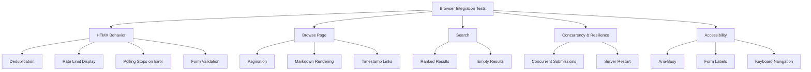

# Design Document: Browser Integration Tests

## Overview

This design extends the existing `tests/integration_browser.rs` test suite with comprehensive browser integration tests covering HTMX behavior, browse page pagination, search functionality, concurrency/resilience, and accessibility. All tests use the established test harness (geckodriver + headless Firefox + in-memory SQLite) and are `#[ignore]` by default.

The tests verify end-to-end user-facing behavior by driving a real browser against the application, confirming that HTMX swaps, form validation, pagination, error handling, and accessibility attributes work correctly in a realistic environment.

## Architecture

### Test Infrastructure Reuse

All new tests reuse the existing helper functions in `tests/integration_browser.rs`:

```
┌─────────────────────────────────────────────────────┐
│  Test Function (#[tokio::test] #[ignore])           │
├─────────────────────────────────────────────────────┤
│  1. start_test_server() → base_url                  │
│     - Creates in-memory SQLite DB                   │
│     - Runs migrations                               │
│     - Binds axum to random port                     │
│  2. start_geckodriver(port) → Child process         │
│  3. connect_browser(port) → fantoccini::Client      │
│  4. Test logic (navigate, interact, assert)         │
│  5. Cleanup (client.close(), geckodriver.kill())    │
└─────────────────────────────────────────────────────┘
```

### Port Allocation Strategy

Each test uses a unique geckodriver port to enable parallel execution:

| Port Range | Tests |
|---|---|
| 4444–4451 | Existing tests |
| 4452–4470 | New tests (this feature) |

### Test Categories



## Components and Interfaces

### New Helper Functions

#### `start_test_server_with_state(state: AppState) -> String`

A variant of `start_test_server()` that accepts a pre-configured `AppState`. This enables tests that need:
- Pre-seeded database records (browse pagination, search, timestamps)
- Custom model configurations (rate limit test with `rpd_limit=1`)

```rust
async fn start_test_server_with_state(state: AppState) -> String {
    let app = build_router(state);
    let listener = TcpListener::bind("127.0.0.1:0").await.unwrap();
    let addr = listener.local_addr().unwrap();
    tokio::spawn(async move {
        axum::serve(listener, app.into_make_service_with_connect_info::<SocketAddr>()).await.unwrap();
    });
    format!("http://{}", addr)
}
```

#### `start_test_server_with_state_and_handle(state: AppState) -> (String, JoinHandle, CancellationToken)`

For the server restart test, we need the ability to stop and restart the server. This variant returns a `tokio_util::sync::CancellationToken` (or uses `tokio::sync::oneshot`) to signal graceful shutdown, plus the `JoinHandle` to await termination.

Since axum's `serve()` supports graceful shutdown via `with_graceful_shutdown(signal)`, we can use a `tokio::sync::watch` channel:

```rust
async fn start_test_server_controllable(state: AppState) -> (String, SocketAddr, tokio::sync::watch::Sender<bool>) {
    let app = build_router(state);
    let listener = TcpListener::bind("127.0.0.1:0").await.unwrap();
    let addr = listener.local_addr().unwrap();
    let (shutdown_tx, mut shutdown_rx) = tokio::sync::watch::channel(false);
    
    tokio::spawn(async move {
        axum::serve(listener, app.into_make_service_with_connect_info::<SocketAddr>())
            .with_graceful_shutdown(async move { shutdown_rx.changed().await.ok(); })
            .await
            .unwrap();
    });
    
    (format!("http://{}", addr), addr, shutdown_tx)
}
```

#### `seed_summaries(db: &SqlitePool, count: usize) -> Vec<i64>`

Seeds the database with `count` summary records for pagination and browse tests. Returns the inserted identifiers.

```rust
async fn seed_summaries(db: &SqlitePool, count: usize) -> Vec<i64> {
    let mut ids = Vec::new();
    for i in 0..count {
        let id = sqlx::query(
            "INSERT INTO summaries (model, original_source_link, transcript, host, summary_timestamp_start, summary, summary_done) \
             VALUES (?, ?, ?, ?, ?, ?, 1)"
        )
        .bind("gemma-3-27b-it")
        .bind(format!("https://youtube.com/watch?v=test{}", i))
        .bind(format!("Transcript for video {}", i))
        .bind("127.0.0.1:0")
        .bind(chrono::Utc::now().to_rfc3339())
        .bind(format!("## Summary {}\n\nThis is **bold** content for video {}.\n\n- Item 1\n- Item 2", i, i))
        .execute(db)
        .await
        .unwrap()
        .last_insert_rowid();
        ids.push(id);
    }
    ids
}
```

#### `seed_summary_with_timestamps(db: &SqlitePool, url: &str) -> i64`

Seeds a single summary with `timestamps_done=true` and timestamped content for the timestamp link test.

#### `test_app_state_with_low_limit() -> AppState`

Creates an `AppState` with a model that has `rpd_limit=1` so the rate limit can be exhausted in a single request.

### Existing Interfaces Used

| Function | Purpose |
|---|---|
| `geckodriver_path()` | Finds geckodriver binary |
| `start_geckodriver(port)` | Starts geckodriver on specified port |
| `connect_browser(port)` | Connects headless Firefox via WebDriver |
| `test_app_state()` | Creates default AppState with in-memory DB |
| `start_test_server()` | Starts server with default state |

### fantoccini Client API

Key methods used across tests:

- `client.goto(url)` — Navigate to URL
- `client.find(Locator::Css(selector))` — Find element by CSS selector
- `client.find_all(Locator::Css(selector))` — Find all matching elements
- `element.text()` — Get visible text content
- `element.html(inner)` — Get inner/outer HTML
- `element.attr(name)` — Get attribute value
- `element.send_keys(text)` — Type into input
- `element.click()` — Click element
- `client.execute(js, args)` — Execute JavaScript
- `client.active_element()` — Get currently focused element

## Data Models

### Test Database Seeding

Tests that need pre-existing data will insert records directly via `sqlx` against the in-memory database before navigating the browser. The `Summary` struct fields relevant to seeding:

| Field | Seeded Value | Used By |
|---|---|---|
| `model` | `"gemma-3-27b-it"` | All seeded records |
| `original_source_link` | Unique YouTube URLs | Browse, timestamps |
| `summary` | Markdown content | Rendering tests |
| `summary_done` | `true` | Browse, rendering |
| `timestamps_done` | `true` | Timestamp link test |
| `timestamped_summary_in_youtube_format` | Content with `0:00`, `1:30` etc. | Timestamp link test |
| `embedding` | Pre-computed byte vector | Search test |

### Rate Limit Test Model Configuration

```rust
ModelOption {
    name: "test-limited-model".to_string(),
    input_price_per_mtoken: 0.0,
    output_price_per_mtoken: 0.0,
    context_window: 128_000,
    rpm_limit: 30,
    rpd_limit: 1,  // Exhausted after a single request
}
```

## Error Handling

### Test Cleanup

Every test follows the pattern:
1. Start geckodriver
2. Connect browser
3. Run assertions
4. `client.close().await.unwrap()`
5. `geckodriver.kill().ok()`

If a test panics mid-execution, the geckodriver process may leak. This is acceptable for test environments since each test uses a unique port and geckodriver processes are lightweight.

### Server Restart Test

The server restart test must handle:
- The browser receiving connection refused errors during the restart window
- HTMX polling retrying automatically (HTMX has built-in retry behavior)
- The in-memory database being lost on restart (new DB instance)

The test verifies that after restart, the browser either:
- Receives a valid "Summary not found" response (graceful degradation), OR
- Receives a valid HTTP response (no unhandled crash)

### Concurrency Test

Two separate `fantoccini::Client` instances connect through the same geckodriver (or separate geckodrivers on different ports). Each submits a different URL and receives an independent polling partial. The test verifies identifier isolation.

## Testing Strategy

### Why Property-Based Testing Does Not Apply

This feature consists entirely of browser integration tests that:
- Drive a real browser (headless Firefox) against a real server
- Test specific UI scenarios with concrete interactions
- Verify external system wiring (browser ↔ server ↔ database)
- Have high per-iteration cost (browser startup, HTTP round-trips)
- Test deterministic UI behavior that doesn't vary meaningfully with random inputs

Property-based testing is designed for pure functions with large input spaces. Browser integration tests are scenario-based by nature — each test verifies a specific user flow. The appropriate testing approach is **example-based integration tests** with specific assertions.

### Test Implementation Approach

All tests are added to the existing `tests/integration_browser.rs` file to share infrastructure. Each test:

1. Is annotated with `#[tokio::test]` and `#[ignore]`
2. Uses a unique geckodriver port (4452+)
3. Starts its own test server (with custom state if needed)
4. Performs browser interactions via fantoccini
5. Makes assertions on DOM state
6. Cleans up browser and geckodriver

### Test List

| # | Test Function | Requirement | Port | Needs Seeding |
|---|---|---|---|---|
| 1 | `test_deduplication_returns_same_id` | Req 1 | 4452 | No |
| 2 | `test_rate_limit_error_display` | Req 2 | 4453 | No |
| 3 | `test_polling_stops_on_error` | Req 3 | 4454 | No |
| 4 | `test_form_required_validation` | Req 4 | 4455 | No |
| 5 | `test_browse_pagination_page_0` | Req 5 | 4456 | 25 records |
| 6 | `test_browse_pagination_page_1` | Req 5 | 4457 | 25 records |
| 7 | `test_browse_no_next_on_last_page` | Req 5 | 4458 | 25 records |
| 8 | `test_summary_markdown_rendering` | Req 6 | 4459 | 1 record |
| 9 | `test_timestamp_links_rendered` | Req 7 | 4460 | 1 record |
| 10 | `test_search_returns_results` | Req 8 | 4461 | Records + embeddings |
| 11 | `test_search_empty_results` | Req 9 | 4462 | No |
| 12 | `test_concurrent_submissions` | Req 10 | 4463–4464 | No |
| 13 | `test_server_restart_recovery` | Req 11 | 4465 | No |
| 14 | `test_aria_busy_during_generation` | Req 12 | 4466 | No |
| 15 | `test_form_input_labels` | Req 13 | 4467 | No |
| 16 | `test_keyboard_navigation` | Req 14 | 4468 | No |

### Key Test Design Decisions

**Deduplication test (Req 1):** Submit a URL via the form, extract the identifier from the returned `#generation` div's `hx-post` attribute (e.g., `/generations/1`), then submit the same URL again and verify the second response contains the same identifier.

**Rate limit test (Req 2):** Use `test_app_state_with_low_limit()` which configures a model with `rpd_limit=1`. Submit once (succeeds, increments counter), then submit again (should show "Rate limit exceeded").

**Browse pagination (Req 5):** Use `seed_summaries(db, 25)` to insert 25 records before starting the server. Navigate to `/browse` and count `<article>` elements. Verify "Next →" link exists on page 0, navigate to page 1, verify 5 articles and "← Previous" link.

**Markdown rendering (Req 6):** Seed a summary with known markdown (`**bold**`, `- list item`, `## Heading`). Navigate to the generation partial endpoint and verify the HTML contains `<strong>`, `<ul>` or `<li>`, and `<h2>` elements.

**Timestamp links (Req 7):** Seed a summary with `timestamps_done=true` and `timestamped_summary_in_youtube_format` containing timestamp text. Load the generation partial and verify `<a>` elements with `href` containing `&t=` parameter.

**Search test (Req 8):** This test requires pre-computed embeddings. Since computing real embeddings requires the Gemini API, the test will either:
- Skip if `GEMINI_API_KEY` is not set (like the existing e2e test), OR
- Insert fake embedding bytes and verify the search endpoint doesn't crash (the cosine similarity will still produce results if embeddings are non-zero vectors)

The pragmatic approach: insert records with synthetic embedding blobs (random f32 vectors serialized to bytes). The search endpoint will compute cosine similarity against these, producing ranked results.

**Concurrent submissions (Req 10):** Start one geckodriver on port 4463, connect two browser clients through it (fantoccini supports multiple sessions on one geckodriver). Each client submits a different URL. Verify each receives a distinct identifier.

**Server restart (Req 11):** Use `start_test_server_controllable()` to get a shutdown handle. Submit a form, verify polling starts, send shutdown signal, wait briefly, start a new server on the same address (rebind the port). Verify the browser eventually gets a response. Since the DB is in-memory, the new server won't have the old record, so it should return "Summary not found."

**Accessibility tests (Req 12–14):** These verify DOM attributes and keyboard behavior:
- `aria-busy="true"` present during generation, absent after completion
- `<label for="url">` and `<label for="model">` exist
- Tab key moves focus through form elements in order

### Running the Tests

```bash
# Run all browser integration tests
cargo test --test integration_browser -- --ignored

# Run a specific test
cargo test --test integration_browser test_deduplication_returns_same_id -- --ignored

# Run with output for debugging
cargo test --test integration_browser -- --ignored --nocapture
```
