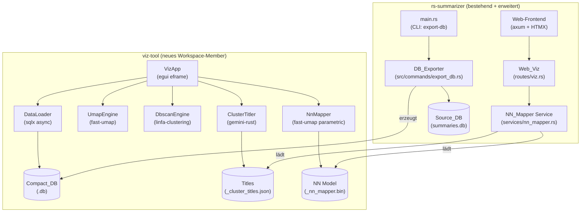

# Design Document: embedding-visualization

## Overview

Dieses Feature erweitert rs-summarizer um eine vollständige Embedding-Visualisierungs-Pipeline in Rust. Der Python-Prototyp (`gemini-summary-embedding`) dient als Referenz: Embeddings aus SQLite werden mit UMAP auf 2D/4D reduziert, mit DBSCAN geclustert, Cluster via Gemini API betitelt und interaktiv visualisiert.

Das Feature besteht aus sechs Komponenten:

1. **Cargo-Workflow-Skill** – Dokumentation für Dependency-Management
2. **DB_Exporter** – CLI-Subcommand in rs-summarizer zum Exportieren einer kompakten DB
3. **Viz_Tool** – Eigenständiges egui-Desktop-GUI als Cargo-Workspace-Member
4. **Cluster_Titler** – Gemini/Gemma API-Integration für automatische Cluster-Betitelung
5. **NN_Mapper** – Parametric UMAP (neuronales Netz) für stabile Out-of-Sample-Projektion
6. **Web_Viz** – HTMX-Integration der 2D-Karte in das bestehende Web-Frontend

### Forschungsergebnisse

**UMAP-Bibliothek:** `eugenehp/fast-umap` ist die einzige Rust-Bibliothek mit Out-of-Sample-Projektion (parametric UMAP via `burn` neural network). Benchmark-Ergebnisse: 497ms für 20.000 Samples × 768 Features auf CPU – ausreichend für interaktive Nutzung.

**Wichtige Einschränkung (DeepWiki-verifiziert):** Das CPU-Backend (`fit_cpu` / `CpuFittedUmap`) unterstützt **kein** `transform` — der Aufruf panict. Parametric UMAP mit Out-of-Sample-Projektion ist ausschließlich über die GPU-Backends (WGPU oder MLX) verfügbar. Das `burn-wgpu`-Backend läuft jedoch auch auf CPUs ohne dedizierte GPU (via Software-Rasterizer). Für das Viz_Tool und den Web-Server wird daher das WGPU-Backend mit `default-features = false, features = ["wgpu"]` verwendet. API: `Umap::new(config).fit(data, None)` → `FittedUmap`, dann `fitted.transform(new_data)` für neue Punkte.

**DBSCAN-Bibliothek:** `linfa-clustering` ist die empfohlene Wahl (schnellste CPU-Implementierung, ~77ms für 10.000 Punkte, Builder-API, ndarray-Integration). Kompatibilität mit `fast-umap`'s transitiver `ndarray`-Version muss beim Dependency-Setup geprüft werden (beide verwenden `ndarray`, ggf. unterschiedliche Versionen → `cargo upgrade` nach dem Hinzufügen beider Dependencies ausführen).

**Embedding-Format:** Matryoshka Float32-Vektoren, Little-Endian in SQLite BLOB gespeichert. Bestehende `bytes_to_embedding`/`embedding_to_bytes` Funktionen in `src/services/embedding.rs` können als Referenz für das Viz_Tool verwendet werden.

**egui-Referenz:** `rs_las_ctl` zeigt das Pattern: `std::thread::spawn` für Hintergrundberechnungen, `mpsc::channel` für Ergebnisübertragung, `ctx.request_repaint()` für GUI-Updates, `egui::ProgressBar` für Fortschrittsanzeige.

**Python-Prototyp-Parameter:** 4D-UMAP mit `n_neighbors=5, min_dist=0.1`, 2D-UMAP mit `n_neighbors=12, min_dist=0.13`, DBSCAN mit `eps=0.3, min_samples=5` auf den 4D-Embeddings.


---

## Architecture

Das Feature folgt einer klaren Trennung zwischen dem bestehenden rs-summarizer (Web-App) und dem neuen Viz_Tool (Desktop-GUI):



### Cargo Workspace

```toml
# rs-summarizer/Cargo.toml (erweitert)
[workspace]
members = [".", "viz-tool"]

[package]
name = "rs-summarizer"
# ... bestehende Felder bleiben erhalten
```

Das Viz_Tool ist ein eigenständiges Binary-Crate mit eigener `Cargo.toml`. Es teilt keine Laufzeit-Dependencies mit dem Hauptprojekt (kein axum im Viz_Tool). `sqlx` und `tokio` werden im Viz_Tool für das Datenladen verwendet.

### CLI-Erweiterung in main.rs

`main.rs` wertet `std::env::args()` aus, bevor der axum-Server gestartet wird:

```rust
// Pseudocode
if args contains "export-db" {
    run_export(parse_export_args(args)).await?;
    return Ok(());
}
// sonst: normaler Server-Start
```


---

## Components and Interfaces

### 1. DB_Exporter (`src/commands/export_db.rs`)

Neuer CLI-Subcommand in `main.rs`. Wird über manuelle Argument-Auswertung aktiviert (kein clap, um die bestehende Dependency-Liste minimal zu halten).

```rust
pub struct ExportDbArgs {
    pub source: PathBuf,
    pub output: PathBuf,
}

pub async fn run_export(args: ExportDbArgs) -> anyhow::Result<()>;
```

**Ablauf:**
1. Prüfe: `source` existiert und ist lesbar → sonst `ExportError::SourceNotFound`
2. Prüfe: `output` existiert nicht → sonst `ExportError::OutputExists`
3. Prüfe: Parent-Verzeichnis von `output` existiert → sonst `ExportError::OutputDirMissing`
4. Öffne `source` als read-only SQLite-Pool (kein WAL-Write nötig)
5. Erstelle `output` als neue SQLite-Datei mit WAL-Mode
6. Erstelle Schema in `output` (nur die exportierten Felder, kein `transcript`)
7. Kopiere Zeilen mit `WHERE embedding IS NOT NULL AND summary_done = 1`
8. Prüfe: mindestens eine Zeile exportiert → sonst `ExportError::NoQualifyingRows`
9. Gib Zeilenanzahl und Dateigröße auf stdout aus

**Compact_DB Schema:**
```sql
PRAGMA journal_mode=WAL;
CREATE TABLE summaries (
    identifier INTEGER PRIMARY KEY,
    original_source_link TEXT NOT NULL DEFAULT '',
    model TEXT NOT NULL DEFAULT '',
    embedding BLOB,
    embedding_model TEXT NOT NULL DEFAULT '',
    summary TEXT NOT NULL DEFAULT '',
    summary_timestamp_start TEXT NOT NULL DEFAULT '',
    summary_timestamp_end TEXT NOT NULL DEFAULT '',
    cost REAL NOT NULL DEFAULT 0.0,
    timestamped_summary_in_youtube_format TEXT NOT NULL DEFAULT ''
);
```

### 2. Viz_Tool (`viz-tool/src/`)

Struktur analog zu `rs_las_ctl`:

```
viz-tool/
├── Cargo.toml
├── deps.md
└── src/
    ├── main.rs           # eframe::run_native, CLI-Argument-Parsing
    ├── app.rs            # VizApp: eframe::App impl
    ├── data_loader.rs    # DataLoader: sqlx-basiertes Laden
    ├── embedding.rs      # bytes_to_embedding, embedding_to_bytes
    ├── umap_engine.rs    # UmapEngine: fast-umap Wrapper
    ├── dbscan_engine.rs  # DbscanEngine: linfa-clustering Wrapper
    ├── cluster_titler.rs # ClusterTitler: Gemini API
    ├── nn_mapper.rs      # NnMapper: parametric UMAP
    └── errors.rs         # VizError enum
```

**VizApp State:**

```rust
pub struct VizApp {
    // Daten
    db_path: Option<PathBuf>,
    points: Vec<EmbeddingPoint>,
    embedding_dim: usize,             // CLI-Parameter, Standard: 768

    // UMAP-Parameter
    umap4d_neighbors: usize,          // Standard: 5
    umap4d_min_dist: f32,             // Standard: 0.1
    umap2d_neighbors: usize,          // Standard: 12
    umap2d_min_dist: f32,             // Standard: 0.13
    embeddings_4d: Option<Vec<[f32; 4]>>,
    embeddings_2d: Option<Vec<[f32; 2]>>,

    // DBSCAN-Parameter
    dbscan_eps: f32,                  // Standard: 0.3
    dbscan_min_samples: usize,        // Standard: 5
    cluster_labels: Option<Vec<i32>>, // -1 = Rauschen

    // Cluster-Titel
    cluster_titles: HashMap<i32, String>,

    // NN-Mapper
    nn_mapper: Option<NnMapper>,

    // UI-Zustand
    status: AppStatus,
    error_message: Option<String>,
    skipped_blobs: usize,
    compute_tx: Sender<ComputeResult>,
    compute_rx: Receiver<ComputeResult>,
}

pub struct EmbeddingPoint {
    pub identifier: i64,
    pub original_source_link: String,
    pub summary: String,
    pub model: String,
    pub embedding_model: String,
    pub timestamped_summary: String,
    pub embedding: Vec<f32>,          // bereits auf embedding_dim trunciert
}

pub enum AppStatus {
    Idle,
    Loading,
    ComputingUmap,
    ComputingDbscan,
    GeneratingTitles,
    TrainingNnMapper,
}

pub enum ComputeResult {
    LoadDone { points: Vec<EmbeddingPoint>, skipped: usize },
    UmapDone { embeddings_4d: Vec<[f32; 4]>, embeddings_2d: Vec<[f32; 2]> },
    DbscanDone { labels: Vec<i32>, n_clusters: usize },
    TitlesDone { titles: HashMap<i32, String> },
    NnMapperDone,
    Error(String),
}
```

**Hintergrundberechnungen:** Alle rechenintensiven Operationen (UMAP, DBSCAN, API-Aufrufe, NN-Training) laufen in `std::thread::spawn`. Ergebnisse werden via `mpsc::channel` zurückgesendet. `ctx.request_repaint()` weckt die GUI nach jedem Update (analog zu `rs_las_ctl`).

**GUI-Layout:**

```
┌─────────────────────────────────────────────────────────────────┐
│ [Status-Banner: "4218 Punkte geladen, 12 übersprungen"]         │
├──────────────────────┬──────────────────────────────────────────┤
│ CONTROLS (links)     │ SCATTER PLOT (rechts, egui_plot)         │
│                      │                                          │
│ [UMAP 4D]            │  · · · · ·  ·                           │
│  n_neighbors: [5]    │    · · ·  · ·  ·                        │
│  min_dist: [0.10]    │  · · "Cluster-Titel" · ·                │
│                      │    · · · · ·                             │
│ [UMAP 2D]            │                                          │
│  n_neighbors: [12]   │  [Tooltip bei Hover]                    │
│  min_dist: [0.13]    │                                          │
│                      │                                          │
│ [Berechnen] ████░░   │                                          │
│                      │                                          │
│ [DBSCAN]             │                                          │
│  eps: [0.30]         │                                          │
│  min_samples: [5]    │                                          │
│ [Clustern]           │                                          │
│ "172 Cluster gefunden"│                                         │
│                      │                                          │
│ [Cluster-Titel gen.] │                                          │
│ [NN-Mapper trainieren]│                                         │
└──────────────────────┴──────────────────────────────────────────┘
```

### 3. DataLoader (`viz-tool/src/data_loader.rs`)

```rust
pub struct LoadResult {
    pub points: Vec<EmbeddingPoint>,
    pub skipped_invalid_length: usize,
    pub skipped_too_short: usize,
}

pub async fn load_compact_db(
    path: &Path,
    embedding_dim: usize,
) -> Result<LoadResult, VizError>;
```

Verwendet `sqlx` mit `SqliteConnectOptions` (read-only). Deserialisiert BLOBs via `bytes_to_embedding`, trunciert auf `embedding_dim`. Überspringt ungültige BLOBs mit stderr-Warnung (`eprintln!`).

### 4. UmapEngine (`viz-tool/src/umap_engine.rs`)

```rust
use fast_umap::prelude::*;

pub struct UmapParams {
    pub n_components: usize,
    pub n_neighbors: usize,
    pub min_dist: f32,
    pub n_epochs: usize,  // Standard: 200
}

/// Berechnet UMAP-Embeddings (nicht-parametric, kein transform-Support).
/// Gibt die reduzierten Koordinaten zurück.
pub fn compute_umap(
    embeddings: &[Vec<f32>],
    params: UmapParams,
) -> Result<Vec<Vec<f32>>, VizError>;

/// Trainiert parametric UMAP (WGPU-Backend) — unterstützt transform().
/// Wird für den NN_Mapper verwendet.
pub fn fit_parametric_umap(
    embeddings: &[Vec<f32>],
    params: UmapParams,
) -> Result<FittedUmap, VizError>;
```

**Wichtig:** `compute_umap` verwendet das WGPU-Backend (`Umap::new(config).fit(data, None)`), da das CPU-Backend (`fit_cpu`) kein `transform` unterstützt. Das WGPU-Backend läuft auch ohne dedizierte GPU via Software-Rasterizer. Prüft `n_neighbors < embeddings.len()` vor dem Aufruf.

### 5. DbscanEngine (`viz-tool/src/dbscan_engine.rs`)

```rust
use linfa_clustering::Dbscan;
use linfa::traits::Transformer;
use ndarray::Array2;

pub struct DbscanParams {
    pub eps: f64,         // linfa verwendet f64
    pub min_samples: usize,
}

pub fn compute_dbscan(
    embeddings_4d: &[[f32; 4]],
    params: DbscanParams,
) -> Result<Vec<i32>, VizError>;
```

Wrapper um `linfa_clustering::Dbscan`. Konvertiert `&[[f32; 4]]` zu `ndarray::Array2<f64>` (linfa erwartet f64). Führt Clustering durch via `Dbscan::params(min_samples).tolerance(eps).transform(&dataset).unwrap()`. Das Ergebnis ist `Array1<Option<usize>>` — `None` entspricht Rauschen (wird zu `-1` konvertiert), `Some(id)` entspricht Cluster-ID (wird zu `id as i32` konvertiert).

### 6. ClusterTitler (`viz-tool/src/cluster_titler.rs`)

```rust
pub async fn generate_titles(
    points: &[EmbeddingPoint],
    labels: &[i32],
    api_key: &str,
    model_name: &str,
) -> Result<HashMap<i32, String>, VizError>;

/// Extrahiert den Abstract-Block aus einer Zusammenfassung.
/// Sucht nach "**Abstract**:" (case-insensitive) und gibt den Text
/// bis zum ersten Timestamp-Marker (\n.*\d+:\d{2}) zurück.
/// Gibt None zurück wenn kein Abstract-Marker gefunden.
pub fn extract_abstract_block(summary: &str) -> Option<String>;

pub fn save_titles(titles: &HashMap<i32, String>, path: &Path) -> Result<(), VizError>;
pub fn load_titles(path: &Path) -> Result<HashMap<i32, String>, VizError>;
```

**Batching-Logik:** Prompts werden akkumuliert bis 20.000 Wörter, dann als separater API-Aufruf gesendet. JSON-Schema: `[{"id": <cluster_id>, "title": "<titel>"}]`. Verwendet `flachesis/gemini-rust` (bereits im Hauptprojekt als Dependency vorhanden) mit folgendem API-Pattern:

```rust
use gemini_rust::{Gemini, Model};

let client = Gemini::with_model(&api_key, Model::Custom(format!("models/{}", model_name)))?;

let response = client
    .generate_content()
    .with_user_message(&prompt)
    .with_response_mime_type("application/json")
    .execute()
    .await?;

let json_text = response.text();
```

**Modell-Auswahl:** Das Modell mit dem höchsten `rpd_limit` aus der konfigurierten Modellliste wird verwendet. Im Viz_Tool wird die Modellliste als Konfigurationsparameter übergeben (analog zu `AppState.model_options` im Hauptprojekt).

### 7. NnMapper (`viz-tool/src/nn_mapper.rs`)

```rust
pub struct NnMapper {
    fitted: FittedUmap,   // WGPU-Backend (unterstützt transform)
    embedding_dim: usize,
}

impl NnMapper {
    pub fn train(
        embeddings: &[Vec<f32>],
        embedding_dim: usize,
        params: UmapParams,
    ) -> Result<Self, VizError>;

    /// Projiziert ein einzelnes Embedding auf 2D.
    /// Gibt VizError::DimensionMismatch zurück wenn embedding.len() != embedding_dim.
    pub fn project(&self, embedding: &[f32]) -> Result<(f32, f32), VizError>;

    pub fn save(&self, path: &Path) -> Result<(), VizError>;

    /// Lädt ein gespeichertes Modell. Benötigt die ursprüngliche UmapConfig
    /// und embedding_dim, die aus der Sidecar-JSON-Datei gelesen werden.
    pub fn load(path: &Path, embedding_dim: usize) -> Result<Self, VizError>;
}
```

`project` prüft `embedding.len() == self.embedding_dim` und gibt `VizError::DimensionMismatch` zurück wenn nicht. Serialisierung: `FittedUmap::save(path)` aus fast-umap (v1.4.0+) — kein externes `bincode` nötig. Beim Speichern wird zusätzlich eine Sidecar-JSON-Datei (`<compact_db_stem>_nn_mapper_config.json`) mit `UmapConfig` und `embedding_dim` angelegt, damit `FittedUmap::load` die nötigen Parameter hat.

### 8. Web_Viz (`src/routes/viz.rs` + Templates)

Neue axum-Routen im Hauptprojekt:

```rust
// GET /viz/map/{identifier} — HTMX-Partial mit 2D-Karte für Summary-Detail
pub async fn viz_map(
    State(app): State<AppState>,
    Path(identifier): Path<i64>,
) -> impl IntoResponse;

// POST /viz/search-map — 2D-Karte für Suchergebnisse
pub async fn viz_search_map(
    State(app): State<AppState>,
    Form(query): Form<SearchForm>,
) -> impl IntoResponse;
```

`AppState` wird um folgende Felder erweitert:

```rust
pub struct AppState {
    // bestehende Felder...
    pub nn_mapper: Option<Arc<NnMapper>>,
    pub viz_data: Option<Arc<VizData>>,
}
```

`VizData` und `NnMapper` werden beim Start von rs-summarizer geladen, falls die entsprechenden Dateien neben der konfigurierten Compact_DB existieren. Der Pfad zur Compact_DB wird als neuer CLI-Parameter oder Umgebungsvariable (`COMPACT_DB_PATH`) konfiguriert.

**`NnMapper` im Hauptprojekt (`src/services/nn_mapper.rs`):**

Der Web-Server braucht `FittedUmap::load`, das ein `burn`-Backend erfordert. Da der rs-summarizer kein GPU-Backend benötigt, wird `burn-ndarray` als CPU-Backend verwendet — dieselbe transitive Dependency, die `fast-umap` ohnehin mitbringt. Der Service ist ein dünner Wrapper:

```rust
// src/services/nn_mapper.rs
use fast_umap::prelude::*;

pub struct NnMapper {
    fitted: FittedUmap,   // WGPU-Backend, läuft auch ohne GPU via Software-Rasterizer
    embedding_dim: usize,
}

impl NnMapper {
    /// Lädt Modell + Sidecar-Config aus dem Dateisystem.
    pub fn load(model_path: &Path) -> Result<Self, NnMapperError>;

    /// Projiziert ein einzelnes Embedding auf 2D.
    /// Gibt NnMapperError::DimensionMismatch zurück wenn embedding.len() != embedding_dim.
    pub fn project(&self, embedding: &[f32]) -> Result<(f32, f32), NnMapperError>;
}
```

`project` ruft intern `self.fitted.transform(vec![embedding.to_vec()])` auf und gibt das erste Element des Ergebnis-Vektors zurück.

Die Karte wird als inline SVG gerendert (kein D3.js-Build-Step nötig). Punkte werden als `<circle>`-Elemente gerendert, Cluster-Titel als `<text>`-Elemente an den Zentroiden.

**egui_plot Scatter-Plot API (verifiziert):**

```rust
use egui_plot::{Plot, Points, PlotPoints, MarkerShape};

Plot::new("umap_scatter")
    .label_formatter(|name, value| {
        format!("{}\nx: {:.3}, y: {:.3}", name, value.x, value.y)
    })
    .show(ui, |plot_ui| {
        // PlotPoints erwartet [f64; 2] — f32-Koordinaten müssen konvertiert werden
        let data: PlotPoints = points_2d.iter()
            .map(|&(x, y)| [x as f64, y as f64])
            .collect();
        plot_ui.points(
            Points::new("cluster_0", data)
                .shape(MarkerShape::Circle)
                .color(Color32::BLUE)
                .radius(3.0)
        );
    });
```

Hover-Tooltips werden über `label_formatter` konfiguriert. Der Name des `Points`-Items wird im Tooltip angezeigt — daher wird pro Cluster ein separates `Points`-Item mit dem Cluster-Titel als Name erstellt.


---

## Data Models

### EmbeddingPoint (Viz_Tool intern)

```rust
pub struct EmbeddingPoint {
    pub identifier: i64,
    pub original_source_link: String,
    pub summary: String,
    pub model: String,
    pub embedding_model: String,
    pub timestamped_summary: String,
    pub embedding: Vec<f32>,  // truncated to embedding_dim
}
```

### ClusterTitle (JSON-Persistenz)

```json
[
  {"id": 5, "title": "PyTorch Performance & Novel ML Techniques"},
  {"id": 14, "title": "Israeli Perspective on Iran Conflict"}
]
```

Dateiname: `<compact_db_stem>_cluster_titles.json` (neben der Compact_DB)

### NN-Mapper-Modell (Binär-Persistenz)

Dateiname: `<compact_db_stem>_nn_mapper.bin` (neben der Compact_DB)

Format: Native Serialisierung via `FittedUmap::save(path)` / `FittedUmap::load(path, config, input_size, device)` aus fast-umap (ab v1.4.0). Intern verwendet `burn`'s `BinFileRecorder` mit `FullPrecisionSettings`. Beim Laden muss die ursprüngliche `UmapConfig` und `embedding_dim` als `input_size` übergeben werden — diese werden zusammen mit dem Modell in einer Sidecar-JSON-Datei (`<compact_db_stem>_nn_mapper_config.json`) gespeichert.

### VizData (Web-Frontend, in-memory)

```rust
pub struct VizData {
    pub points_2d: Vec<(i64, f32, f32)>,           // (identifier, x, y)
    pub cluster_labels: HashMap<i64, i32>,          // identifier -> label
    pub cluster_titles: HashMap<i32, String>,       // label -> title
    pub cluster_centroids: HashMap<i32, (f32, f32)>, // label -> (cx, cy)
}
```

Wird beim Start von rs-summarizer aus der Compact_DB und den JSON/Bin-Dateien geladen, falls vorhanden. Wenn keine Compact_DB konfiguriert ist, bleibt `viz_data: None` und die Web_Viz-Routen geben leere Responses zurück.

### AppState-Erweiterung

```rust
pub struct AppState {
    pub db: SqlitePool,
    pub model_options: Arc<Vec<ModelOption>>,
    pub model_counts: Arc<RwLock<HashMap<String, u32>>>,
    pub last_reset_day: Arc<RwLock<Option<NaiveDate>>>,
    pub gemini_api_key: String,
    // Neu:
    pub nn_mapper: Option<Arc<NnMapper>>,
    pub viz_data: Option<Arc<VizData>>,
}
```

---

## Correctness Properties

*A property is a characteristic or behavior that should hold true across all valid executions of a system — essentially, a formal statement about what the system should do. Properties serve as the bridge between human-readable specifications and machine-verifiable correctness guarantees.*

### Property 1: Embedding Round-Trip

*For any* valid sequence of `f32` values, serializing to a Little-Endian byte array and then deserializing back should produce a sequence that is element-wise identical to the original.

**Validates: Requirements 12.1, 12.2**

### Property 2: Embedding Truncation

*For any* embedding BLOB that contains at least `embedding_dim * 4` bytes, after deserialization and truncation to `embedding_dim` elements, the resulting `Vec<f32>` should have exactly `embedding_dim` elements, and those elements should equal the first `embedding_dim` values of the full deserialized vector.

**Validates: Requirements 12.3, 4.4**

### Property 3: Export Field Correctness

*For any* source database containing rows with `embedding IS NOT NULL AND summary_done = 1`, the exported compact database should contain exactly those rows with all specified fields (`identifier`, `original_source_link`, `model`, `embedding`, `embedding_model`, `summary`, `summary_timestamp_start`, `summary_timestamp_end`, `cost`, `timestamped_summary_in_youtube_format`) having identical values to the source, and the `transcript` field must not be present in the compact database schema.

**Validates: Requirements 2.2, 2.3**

### Property 4: Export Filter Correctness

*For any* source database with a mix of rows (some with `embedding IS NULL`, some with `summary_done = 0`, some qualifying with both conditions met), the exported compact database should contain exactly the rows where `embedding IS NOT NULL AND summary_done = 1`, and no others.

**Validates: Requirements 2.4**

### Property 5: Source DB Immutability

*For any* source database, after running the export command, the source database file should be byte-identical to its state before the export was run.

**Validates: Requirements 2.5**

### Property 6: Abstract Block Extraction

*For any* summary string that contains an `**Abstract**:` marker (case-insensitive) followed by content and then a timestamp line (`\n.*\d+:\d{2}`), the extracted abstract block should be the text between the end of the `**Abstract**:` marker and the start of the first timestamp line, stripped of leading/trailing whitespace.

**Validates: Requirements 8.2**

### Property 7: Nearest-Neighbor Correctness

*For any* set of 2D points and any query point, the computed k nearest neighbors should be the k points with the smallest Euclidean distance to the query point, and the result should be sorted by ascending distance.

**Validates: Requirements 10.7**

### Property 8: Valid BLOB Count

*For any* collection of BLOBs where some are valid (length is a multiple of 4 and `>= embedding_dim * 4`) and some are invalid, the count of successfully loaded embeddings should equal exactly the number of valid BLOBs in the collection.

**Validates: Requirements 12.6, 4.6**

---

## Error Handling

### VizError (viz-tool)

```rust
#[derive(Debug, thiserror::Error)]
pub enum VizError {
    #[error("Datenbankfehler: {0}")]
    Database(#[from] sqlx::Error),

    #[error("I/O-Fehler: {0}")]
    Io(#[from] std::io::Error),

    #[error("UMAP-Fehler: {0}")]
    Umap(String),

    #[error("DBSCAN-Fehler: {0}")]
    Dbscan(String),

    #[error("API-Fehler: {0}")]
    Api(String),

    #[error("Ungültige Embedding-Dimension: erwartet {expected}, erhalten {actual}")]
    DimensionMismatch { expected: usize, actual: usize },

    #[error("Ungültiger BLOB (Länge {0} ist kein Vielfaches von 4)")]
    InvalidBlobLength(usize),

    #[error("BLOB zu kurz: {actual} Bytes, benötigt {required}")]
    BlobTooShort { actual: usize, required: usize },

    #[error("Modell-Datei konnte nicht geladen werden: {0}")]
    ModelLoadError(String),

    #[error("Keine Embeddings vorhanden")]
    NoEmbeddings,

    #[error("UMAP muss zuerst berechnet werden")]
    UmapNotComputed,

    #[error("n_neighbors ({0}) muss kleiner als die Anzahl der Punkte ({1}) sein")]
    InsufficientPoints(usize, usize),
}
```

### ExportError (rs-summarizer)

```rust
#[derive(Debug, thiserror::Error)]
pub enum ExportError {
    #[error("Quelldatei nicht gefunden: {0}")]
    SourceNotFound(PathBuf),

    #[error("Zieldatei existiert bereits: {0}")]
    OutputExists(PathBuf),

    #[error("Ausgabeverzeichnis existiert nicht: {0}")]
    OutputDirMissing(PathBuf),

    #[error("Keine exportierbaren Zeilen gefunden (embedding IS NOT NULL AND summary_done = 1)")]
    NoQualifyingRows,

    #[error("Datenbankfehler: {0}")]
    Database(#[from] sqlx::Error),

    #[error("I/O-Fehler: {0}")]
    Io(#[from] std::io::Error),
}
```

### Fehlerbehandlung in der GUI

Alle Fehler aus Hintergrundthreads werden als `ComputeResult::Error(String)` zurückgesendet und in `app.error_message` gespeichert. Die GUI zeigt Fehler in einem roten Banner an. Nicht-fatale Fehler (übersprungene BLOBs) werden auf stderr geloggt und als `skipped_blobs`-Counter in der Statusleiste angezeigt.

Fehler-Hierarchie:
- **Fatal** (Laden schlägt fehl): Fehlermeldung in der GUI, kein Plot
- **Recoverable** (UMAP/DBSCAN schlägt fehl): Fehlermeldung, vorheriges Ergebnis bleibt erhalten
- **Non-fatal** (BLOB übersprungen): stderr-Warnung, Laden wird fortgesetzt

---

## Testing Strategy

### Property-Based Tests

Property-Based Testing wird mit `proptest` durchgeführt (bereits in `[dev-dependencies]` des Hauptprojekts vorhanden; wird auch in `viz-tool/Cargo.toml` als dev-dependency eingetragen). Jeder Property-Test läuft mit mindestens 100 Iterationen.

**Feature: embedding-visualization, Property 1: Embedding Round-Trip**
```rust
// viz-tool/src/embedding.rs
proptest! {
    #[test]
    // Feature: embedding-visualization, Property 1: Embedding Round-Trip
    fn prop_embedding_roundtrip(
        values in prop::collection::vec(prop::num::f32::NORMAL, 1usize..=3072)
    ) {
        let bytes = embedding_to_bytes(&values);
        let recovered = bytes_to_embedding(&bytes);
        prop_assert_eq!(values.len(), recovered.len());
        for (a, b) in values.iter().zip(recovered.iter()) {
            prop_assert_eq!(a.to_bits(), b.to_bits()); // bit-exact comparison
        }
    }
}
```

**Feature: embedding-visualization, Property 2: Embedding Truncation**
```rust
// viz-tool/src/embedding.rs
proptest! {
    #[test]
    // Feature: embedding-visualization, Property 2: Embedding Truncation
    fn prop_embedding_truncation(
        values in prop::collection::vec(prop::num::f32::NORMAL, 768usize..=3072),
        dim in 1usize..=768usize
    ) {
        let bytes = embedding_to_bytes(&values);
        let truncated = bytes_to_embedding_truncated(&bytes, dim).unwrap();
        prop_assert_eq!(truncated.len(), dim);
        for (i, (a, b)) in values[..dim].iter().zip(truncated.iter()).enumerate() {
            prop_assert_eq!(a.to_bits(), b.to_bits(),
                "Mismatch at index {}", i);
        }
    }
}
```

**Feature: embedding-visualization, Property 6: Abstract Block Extraction**
```rust
// viz-tool/src/cluster_titler.rs
proptest! {
    #[test]
    // Feature: embedding-visualization, Property 6: Abstract Block Extraction
    fn prop_abstract_extraction(
        abstract_text in "[a-zA-Z0-9 .,!?]{1,200}",
        suffix in "[a-zA-Z0-9 .,!?]{0,50}"
    ) {
        let timestamp = "\n* 0:00 Some section";
        let summary = format!("**Abstract**:\n\n{}{}{}", abstract_text, suffix, timestamp);
        let result = extract_abstract_block(&summary);
        prop_assert!(result.is_some());
        let block = result.unwrap();
        // Block should contain the abstract text
        prop_assert!(block.contains(&abstract_text[..abstract_text.len().min(50)]));
        // Block should not contain the timestamp marker
        prop_assert!(!block.contains("0:00"));
    }
}
```

**Feature: embedding-visualization, Property 7: Nearest-Neighbor Correctness**
```rust
// src/routes/viz.rs (oder src/utils/viz_utils.rs)
proptest! {
    #[test]
    // Feature: embedding-visualization, Property 7: Nearest-Neighbor Correctness
    fn prop_nearest_neighbors(
        points in prop::collection::vec(
            (prop::num::f32::NORMAL, prop::num::f32::NORMAL),
            5usize..=50
        ),
        qx in prop::num::f32::NORMAL,
        qy in prop::num::f32::NORMAL,
        k in 1usize..=5usize
    ) {
        let result = find_k_nearest_2d(&points, (qx, qy), k);
        let actual_k = k.min(points.len());
        prop_assert_eq!(result.len(), actual_k);

        // Result must be sorted by ascending distance
        let dists: Vec<f32> = result.iter()
            .map(|&(x, y)| ((x - qx).powi(2) + (y - qy).powi(2)).sqrt())
            .collect();
        prop_assert!(dists.windows(2).all(|w| w[0] <= w[1] + 1e-5));

        // No point outside result should be closer than the farthest result point
        if let Some(&max_dist) = dists.last() {
            for &(px, py) in &points {
                let d = ((px - qx).powi(2) + (py - qy).powi(2)).sqrt();
                if !result.contains(&(px, py)) {
                    prop_assert!(d >= max_dist - 1e-5);
                }
            }
        }
    }
}
```

### Unit Tests

**`viz-tool/src/embedding.rs`:**
- `test_bytes_to_embedding_empty` — leerer BLOB gibt leeren Vec zurück
- `test_invalid_blob_length` — BLOB-Länge kein Vielfaches von 4 → `VizError::InvalidBlobLength`
- `test_blob_too_short` — BLOB kürzer als `embedding_dim * 4` → `VizError::BlobTooShort`

**`viz-tool/src/cluster_titler.rs`:**
- `test_extract_abstract_no_marker` — kein `**Abstract**:` → `None`
- `test_extract_abstract_no_timestamp` — kein Timestamp → gesamter Text nach Marker
- `test_extract_abstract_case_insensitive` — `abstract:` (lowercase) wird erkannt

**`viz-tool/src/nn_mapper.rs`:**
- `test_project_dimension_mismatch` — falsche Embedding-Dimension → `VizError::DimensionMismatch`

**`src/commands/export_db.rs`:**
- `test_output_exists_error` — Zieldatei existiert bereits → `ExportError::OutputExists`
- `test_no_qualifying_rows_error` — keine qualifizierenden Zeilen → `ExportError::NoQualifyingRows`
- `test_source_not_found` — Quelldatei existiert nicht → `ExportError::SourceNotFound`
- `test_output_dir_missing` — Ausgabeverzeichnis existiert nicht → `ExportError::OutputDirMissing`
- `test_wal_mode_enabled` — Compact_DB hat WAL-Mode aktiviert

### Integration Tests

- **Export-CLI:** Vollständiger Export-Durchlauf mit echter SQLite-Datenbank (temporäre Datei), Verifikation der exportierten Felder und Zeilenanzahl
- **Viz_Tool Datenladen:** Laden einer Test-Compact_DB, Verifikation der geladenen Punkte und übersprungenen BLOBs
- **UMAP + DBSCAN Pipeline:** End-to-End-Test mit kleinem synthetischen Datensatz (50 Punkte × 10 Dimensionen), Verifikation dass Labels zurückgegeben werden
- **Web_Viz Route:** HTMX-Partial-Rendering mit Mock-VizData, Verifikation dass SVG-Elemente im Response enthalten sind

### Nicht durch PBT abgedeckt

- UMAP-Qualität (algorithmische Korrektheit von fast-umap — durch externe Tests abgedeckt)
- DBSCAN-Qualität (algorithmische Korrektheit von linfa-clustering — durch externe Tests abgedeckt)
- GUI-Rendering (visuell, nicht automatisch testbar)
- Gemini API-Aufrufe (Integration, nicht Unit-Tests)
- NN-Mapper-Trainingsqualität (ML-Modell, nicht durch einfache Properties testbar)
- Cargo-Skill-Dokumentation (Requirement 1 — manuelle Verifikation)
- Viz_Tool-Subprojekt-Struktur (Requirement 3 — Smoke-Tests via `cargo check`)
