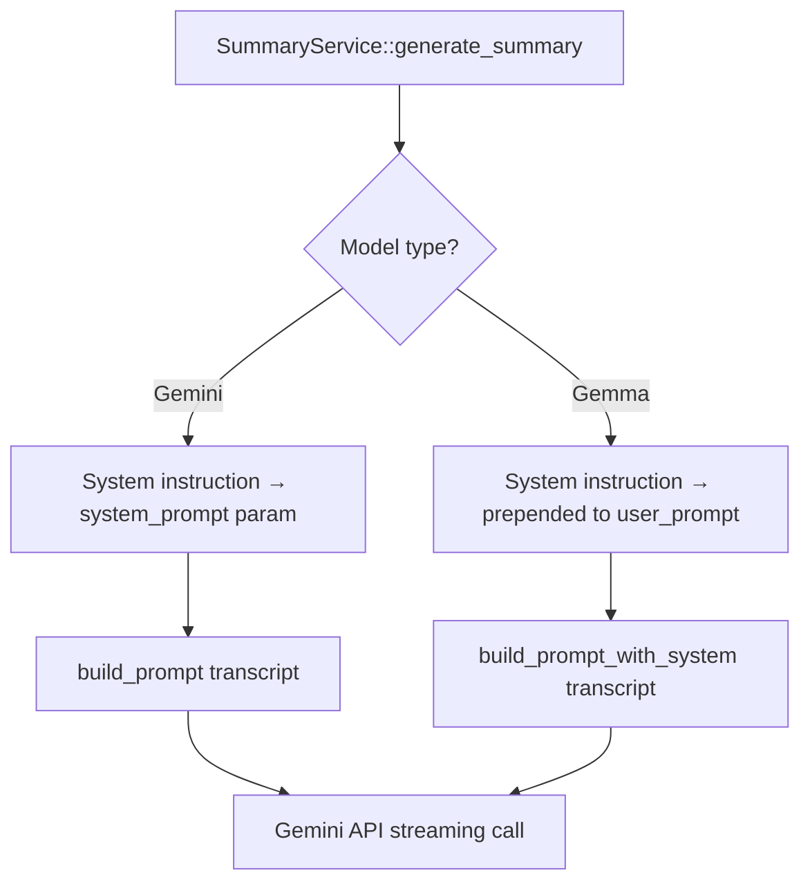

# Design Document: Enhanced Summary Prompt

## Overview

This feature replaces the minimal prompt in `SummaryService` with the full prompt structure used by the Python program (`source04/tsum/p04_host.py`). The enhanced prompt includes:

1. A detailed "adaptive knowledge synthesis engine" system instruction
2. A few-shot example (example input → example abstract + example summary)
3. A structured user prompt template matching the Python `get_prompt()` function

All prompt text assets are compiled into the binary via `include_str!` macros, ensuring immutability at runtime and byte-for-byte consistency with the Python source files.

The key behavioral change is model-aware prompt routing: Gemini models receive the system instruction as a separate API parameter, while Gemma models (which lack system instruction support) receive it prepended to the user prompt.

## Architecture

The change is localized to `src/services/summary.rs`. No new modules or crates are needed.



**Design Decision**: Rather than creating a separate prompt module, the prompt constants and construction logic remain in `summary.rs`. The prompt assets are small (a few KB each) and tightly coupled to the summary generation logic. Extracting them would add indirection without meaningful benefit.

## Components and Interfaces

### Prompt Asset Constants

Four `include_str!` constants at module level in `src/services/summary.rs`:

```rust
/// The "adaptive knowledge synthesis engine" persona prompt.
const SYSTEM_INSTRUCTION: &str = include_str!("../../prompts/system_instruction.txt");

/// Example input: title, description, comments, and transcript of a demo video.
const EXAMPLE_INPUT: &str = include_str!("../../prompts/example_input.txt");

/// Example output: the expected abstract for the demo video.
const EXAMPLE_OUTPUT_ABSTRACT: &str = include_str!("../../prompts/example_output_abstract.txt");

/// Example output: the expected bullet-point summary for the demo video.
const EXAMPLE_OUTPUT: &str = include_str!("../../prompts/example_output.txt");
```

**Design Decision**: Assets are placed in `rs-summarizer/prompts/` at the project root (sibling to `src/`). This keeps them out of the source tree but accessible via relative paths from `src/services/summary.rs`. The `../../prompts/` path is relative to the file containing the `include_str!` macro.

### Refactored `build_prompt` Method

The current signature:

```rust
pub fn build_prompt(&self, transcript: &str) -> String
```

Becomes:

```rust
pub fn build_prompt(&self, transcript: &str) -> String
```

The signature stays the same — the method now constructs the full template internally using the compiled constants. The template matches the Python `get_prompt()` exactly:

```
Below, I will provide input for an example video (comprising of title, description, and transcript, in this order) and the corresponding abstract and summary I expect. Afterward, I will provide a new transcript that I want a summarization in the same format.

**Please give an abstract of the transcript and then summarize the transcript in a self-contained bullet list format.** Include starting timestamps, important details and key takeaways.

Example Input:
{EXAMPLE_INPUT}
Example Output:
{EXAMPLE_OUTPUT_ABSTRACT}
{EXAMPLE_OUTPUT}
Here is the real transcript. What would be a good group of people to review this topic? Please summarize provide a summary like they would:
{transcript}
```

### Model-Aware System Instruction Routing

In `generate_summary`, the existing branching logic is updated:

```rust
if !model.name.starts_with("gemma") {
    // Gemini models: pass system instruction as API parameter
    builder = builder.with_system_prompt(SYSTEM_INSTRUCTION);
    let prompt = self.build_prompt(transcript);
    // ... use prompt as user message
} else {
    // Gemma models: prepend system instruction to user prompt
    let prompt = self.build_prompt_for_gemma(transcript);
    // ... use prompt as user message, no system_prompt param
}
```

A helper method for Gemma:

```rust
fn build_prompt_for_gemma(&self, transcript: &str) -> String {
    format!(
        "{}\n\n---\n\n{}",
        SYSTEM_INSTRUCTION,
        self.build_prompt(transcript)
    )
}
```

**Design Decision**: The delimiter between system instruction and user prompt for Gemma is `\n\n---\n\n` (a horizontal rule). This provides clear visual separation without interfering with the model's interpretation of the prompt content.

### File Layout

```
rs-summarizer/
├── prompts/
│   ├── system_instruction.txt    # Copied from Python generate_and_save
│   ├── example_input.txt         # Copied from source04/tsum/example_input.txt
│   ├── example_output.txt        # Copied from source04/tsum/example_output.txt
│   └── example_output_abstract.txt  # Copied from source04/tsum/example_output_abstract.txt
└── src/
    └── services/
        └── summary.rs            # Modified: new constants + refactored build_prompt
```

## Data Models

No new data models are introduced. The existing `SummaryResult`, `ModelOption`, and streaming response types remain unchanged.

The only data change is the content of the prompt string passed to the Gemini API — it grows from ~100 characters to several KB (due to the few-shot example), which increases input token count and cost per request. This is expected and matches the Python program's behavior.

## Correctness Properties

*A property is a characteristic or behavior that should hold true across all valid executions of a system — essentially, a formal statement about what the system should do. Properties serve as the bridge between human-readable specifications and machine-verifiable correctness guarantees.*

### Property 1: Prompt template structure

*For any* valid transcript string, the user prompt returned by `build_prompt` SHALL contain the instruction paragraph, the bold formatting instruction, the "Example Input:" marker followed by the example input content, the "Example Output:" marker followed by the example abstract and example summary, the "Here is the real transcript" framing, and the transcript itself — in that exact order.

**Validates: Requirements 4.1, 4.2, 4.3, 4.4, 4.5, 5.1, 5.2, 5.3, 5.4**

### Property 2: Gemini model prompt routing

*For any* model whose name does not start with "gemma", the system instruction SHALL be passed as the system prompt parameter, and the user prompt SHALL NOT contain the system instruction text.

**Validates: Requirements 2.1, 2.3**

### Property 3: Gemma model prompt injection

*For any* model whose name starts with "gemma", the user prompt SHALL begin with the system instruction text followed by a delimiter (`---`), and no system prompt parameter SHALL be set.

**Validates: Requirements 3.1, 3.2, 3.3**

## Error Handling

No new error conditions are introduced. The enhanced prompt is a pure string construction — it cannot fail at runtime since all inputs are either compile-time constants or the transcript string already validated upstream.

Existing error handling remains unchanged:
- Rate-limit errors (`ResourceExhausted`, `429`) → `SummaryError::RateLimited`
- Empty API response → `SummaryError::ApiError`
- Transcript too short/long → validated before prompt construction

The larger prompt size (due to the few-shot example) may increase the likelihood of hitting token limits on models with smaller context windows, but this is handled by the existing `word_count > 280_000` check which prevents excessively large transcripts.

## Testing Strategy

### Property-Based Tests

Property-based testing is appropriate here because `build_prompt` and `build_prompt_for_gemma` are pure functions with clear input/output behavior. The input space (arbitrary transcript strings) is large, and universal structural properties must hold across all inputs.

**Library**: `proptest` (already available in the Rust ecosystem, standard choice for Rust PBT)

**Configuration**: Minimum 100 iterations per property test.

**Tag format**: `Feature: enhanced-summary-prompt, Property {N}: {description}`

Tests:
1. **Property 1 test**: Generate random transcript strings (including empty, whitespace-only, unicode, very long). Verify `build_prompt(transcript)` contains all required sections in the correct order by checking substring positions.
2. **Property 2 test**: Generate random non-gemma model names. Call the prompt construction logic and verify system instruction is not present in the user prompt string.
3. **Property 3 test**: Generate random gemma-prefixed model names and transcripts. Verify the combined prompt starts with the system instruction, contains the `---` delimiter, and the template follows after.

### Unit Tests (Example-Based)

- Verify `SYSTEM_INSTRUCTION` constant is non-empty and contains "CORE INSTRUCTION"
- Verify `EXAMPLE_INPUT` constant is non-empty and contains expected content (e.g., "Fluidigm Polaris")
- Verify `EXAMPLE_OUTPUT` constant is non-empty
- Verify `EXAMPLE_OUTPUT_ABSTRACT` constant is non-empty and contains "Abstract"
- Verify `build_prompt` with a known transcript produces output matching the Python `get_prompt` template structure
- Verify the `---` delimiter is present in Gemma prompt output

### Integration Tests

- Existing integration tests (`integration_pipeline.rs`) continue to validate end-to-end streaming, DB persistence, and cost computation with the enhanced prompt
- No new integration tests needed — the change is purely in prompt content, not in the streaming/persistence pipeline
