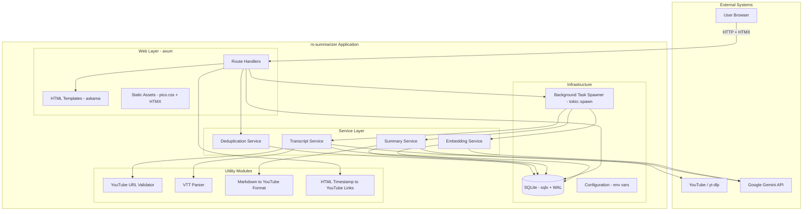
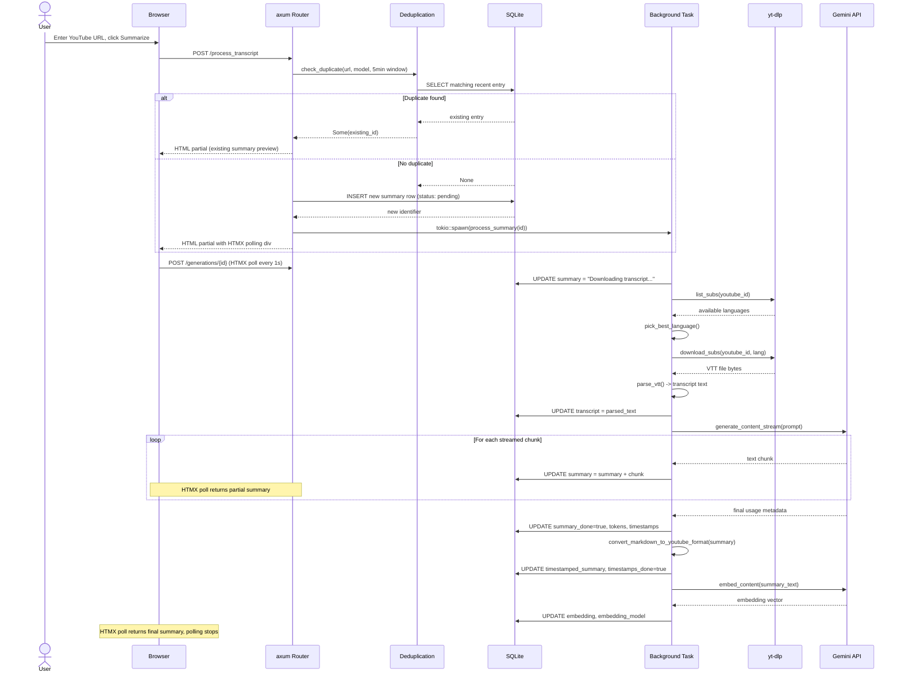
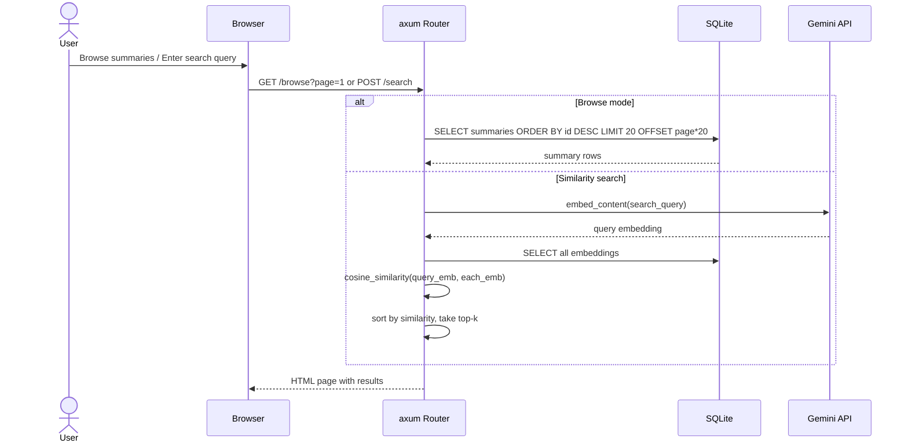

# Design Document: rs-summarizer

## Overview

rs-summarizer is a Rust port of the Python-based RocketRecap YouTube video transcript summarizer. The application provides a web interface where users submit YouTube URLs, the system downloads captions via yt-dlp, generates AI-powered summaries using Google Gemini, computes vector embeddings for similarity search, and stores everything in SQLite. The frontend uses HTMX for real-time progressive updates during summary generation.

The Rust port targets improved performance for large databases (2GB+), better concurrency via tokio's async runtime, and type safety throughout the pipeline. The architecture mirrors the Python version's single-process model with background task processing, but leverages Rust's ownership model and async ecosystem for safer concurrent database access and streaming.

## Architecture

The system follows a layered architecture with a web layer (axum), a service layer for orchestrating summarization workflows, and a data layer backed by SQLite via sqlx. Background tasks handle the potentially long-running transcript download and AI generation steps, while the web layer serves the HTMX-driven UI and polling endpoints.



## Sequence Diagrams

### Main Summarization Flow



### Browse & Similarity Search Flow



## Components and Interfaces

### Component 1: Web Layer (axum routes)

**Purpose**: Serves the HTMX-driven UI, handles form submissions, and provides polling endpoints for real-time updates.

```rust
// Route handler signatures
async fn index(State(app): State<AppState>) -> impl IntoResponse;
async fn process_transcript(
    State(app): State<AppState>,
    ConnectInfo(addr): ConnectInfo<SocketAddr>,
    Form(input): Form<SubmitForm>,
) -> impl IntoResponse;
async fn get_generation(
    State(app): State<AppState>,
    Path(identifier): Path<i64>,
) -> impl IntoResponse;
async fn browse_summaries(
    State(app): State<AppState>,
    Query(params): Query<BrowseParams>,
) -> impl IntoResponse;
async fn search_similar(
    State(app): State<AppState>,
    Form(query): Form<SearchForm>,
) -> impl IntoResponse;
```

**Responsibilities**:
- Serve the main HTML page with submission form
- Accept transcript/URL submissions and spawn background tasks
- Provide HTMX polling endpoint for progressive summary display
- Serve browse and search pages
- Return appropriate HTML partials for HTMX swaps

### Component 2: Transcript Service

**Purpose**: Downloads and parses YouTube video transcripts using yt-dlp.

```rust
pub struct TranscriptService {
    temp_dir: PathBuf,
}

impl TranscriptService {
    pub async fn download_transcript(
        &self,
        url: &str,
        identifier: i64,
    ) -> Result<String, TranscriptError>;
    
    fn pick_best_language(&self, list_output: &str) -> Option<String>;
    fn parse_vtt(&self, vtt_content: &str) -> String;
}

#[derive(Debug, thiserror::Error)]
pub enum TranscriptError {
    #[error("Invalid YouTube URL: {0}")]
    InvalidUrl(String),
    #[error("No subtitles available for this video")]
    NoSubtitles,
    #[error("yt-dlp execution failed: {0}")]
    YtDlpFailed(String),
    #[error("Download timeout after {0}s")]
    Timeout(u64),
    #[error("VTT parse error: {0}")]
    ParseError(String),
}
```

**Responsibilities**:
- Validate YouTube URLs and extract video IDs
- Invoke yt-dlp to list available subtitle languages
- Select the best language using priority ordering
- Download VTT subtitle files
- Parse VTT into plain text with second-granularity timestamps
- Clean up temporary files

### Component 3: Summary Service

**Purpose**: Orchestrates AI summary generation via Gemini, with streaming support.

```rust
pub struct SummaryService {
    gemini_client: GeminiClient,
    model_options: Vec<ModelOption>,
}

#[derive(Clone)]
pub struct ModelOption {
    pub name: String,
    pub input_price_per_mtoken: f64,
    pub output_price_per_mtoken: f64,
    pub context_window: u64,
    pub rpm_limit: u32,
    pub rpd_limit: u32,
}

impl SummaryService {
    pub async fn generate_summary(
        &self,
        db: &SqlitePool,
        identifier: i64,
        transcript: &str,
        model: &ModelOption,
    ) -> Result<SummaryResult, SummaryError>;

    fn build_prompt(&self, transcript: &str) -> String;
    fn compute_cost(
        &self,
        model: &ModelOption,
        input_tokens: u64,
        output_tokens: u64,
    ) -> f64;
}

#[derive(Debug)]
pub struct SummaryResult {
    pub summary_text: String,
    pub input_tokens: u64,
    pub output_tokens: u64,
    pub cost: f64,
    pub duration_secs: f64,
}

#[derive(Debug, thiserror::Error)]
pub enum SummaryError {
    #[error("Gemini API error: {0}")]
    ApiError(String),
    #[error("Resource exhausted - rate limited")]
    RateLimited,
    #[error("Transcript too short (< 30 words)")]
    TranscriptTooShort,
    #[error("Transcript too long ({0} words, max {1})")]
    TranscriptTooLong(usize, usize),
}
```

**Responsibilities**:
- Build prompts from transcript with example input/output
- Stream responses from Gemini and persist chunks to DB progressively
- Track token usage and compute cost
- Convert final summary to YouTube format
- Handle rate limiting and API errors gracefully

### Component 4: Embedding Service

**Purpose**: Computes vector embeddings for summaries to enable similarity search.

```rust
pub struct EmbeddingService {
    gemini_client: GeminiClient,
    model: String,          // "gemini-embedding-001"
    dimensions: usize,      // 3072
}

impl EmbeddingService {
    pub async fn embed_text(&self, text: &str) -> Result<Vec<f32>, EmbeddingError>;
    
    pub fn cosine_similarity(a: &[f32], b: &[f32]) -> f32;
    
    pub async fn find_similar(
        &self,
        db: &SqlitePool,
        query_embedding: &[f32],
        top_k: usize,
    ) -> Result<Vec<(i64, f32)>, EmbeddingError>;
}

#[derive(Debug, thiserror::Error)]
pub enum EmbeddingError {
    #[error("Embedding API error: {0}")]
    ApiError(String),
    #[error("Empty text provided")]
    EmptyText,
    #[error("Database error: {0}")]
    DbError(#[from] sqlx::Error),
}
```

**Responsibilities**:
- Compute embeddings via Gemini embedding model
- Store embeddings as raw f32 byte blobs in SQLite
- Load and deserialize embeddings for similarity computation
- Compute cosine similarity between vectors
- Return top-k most similar summaries

### Component 5: Deduplication Service

**Purpose**: Prevents duplicate submissions within a configurable time window.

```rust
pub struct DeduplicationService {
    window: Duration, // default: 5 minutes
}

impl DeduplicationService {
    pub async fn check_duplicate(
        &self,
        db: &SqlitePool,
        url: &str,
        model: &str,
    ) -> Result<Option<i64>, sqlx::Error>;
    
    pub async fn check_duplicate_by_transcript(
        &self,
        db: &SqlitePool,
        transcript: &str,
        model: &str,
    ) -> Result<Option<i64>, sqlx::Error>;
}
```

**Responsibilities**:
- Query recent entries matching URL + model within time window
- Query recent entries matching transcript + model within time window
- Return existing identifier if duplicate found

## Data Models

### Summary (Database Row)

```rust
#[derive(Debug, Clone, sqlx::FromRow, Serialize, Deserialize)]
pub struct Summary {
    pub identifier: i64,
    pub model: String,
    pub transcript: String,
    pub host: String,
    pub original_source_link: String,
    pub include_comments: bool,
    pub include_timestamps: bool,
    pub include_glossary: bool,
    pub output_language: String,
    pub summary: String,
    pub summary_done: bool,
    pub summary_input_tokens: i64,
    pub summary_output_tokens: i64,
    pub summary_timestamp_start: String,
    pub summary_timestamp_end: String,
    pub timestamps: String,
    pub timestamps_done: bool,
    pub timestamps_input_tokens: i64,
    pub timestamps_output_tokens: i64,
    pub timestamps_timestamp_start: String,
    pub timestamps_timestamp_end: String,
    pub timestamped_summary_in_youtube_format: String,
    pub cost: f64,
    pub embedding: Option<Vec<u8>>,
    pub embedding_model: String,
    pub full_embedding: Option<Vec<u8>>,
}
```

**Validation Rules**:
- `identifier` is auto-incremented by SQLite
- `original_source_link` must be a valid YouTube URL or empty string
- `transcript` must be non-empty and <= 280,000 words
- `model` must match one of the configured MODEL_OPTIONS
- `embedding` and `full_embedding` are nullable (computed asynchronously)
- Timestamps are ISO 8601 format strings

### SubmitForm (User Input)

```rust
#[derive(Debug, Deserialize)]
pub struct SubmitForm {
    pub original_source_link: String,
    pub transcript: Option<String>,
    pub model: String,
}
```

**Validation Rules**:
- At least one of `original_source_link` or `transcript` must be non-empty
- `model` must be a valid model option string

### AppState (Shared Application State)

```rust
#[derive(Clone)]
pub struct AppState {
    pub db: SqlitePool,
    pub transcript_svc: Arc<TranscriptService>,
    pub summary_svc: Arc<SummaryService>,
    pub embedding_svc: Arc<EmbeddingService>,
    pub dedup_svc: Arc<DeduplicationService>,
    pub model_options: Arc<Vec<ModelOption>>,
    pub model_counts: Arc<RwLock<HashMap<String, u32>>>,
    pub last_reset_day: Arc<RwLock<Option<NaiveDate>>>,
}
```


## Algorithmic Pseudocode

### Main Processing Algorithm

```rust
/// Core background task that orchestrates the full summarization pipeline.
/// Spawned by tokio after a new summary row is inserted.
async fn process_summary(db: SqlitePool, identifier: i64, app: AppState) -> Result<(), ProcessError> {
    // PRECONDITION: Row with `identifier` exists in DB with at least url or transcript set
    // POSTCONDITION: Row is fully populated with summary, embeddings, cost, and timestamps_done=true
    //                OR row has an error message in summary field

    // Step 1: Ensure row exists (retry with backoff)
    let summary = wait_until_row_exists(&db, identifier, Duration::from_millis(100), 400).await?;

    // Step 2: Download transcript if not provided
    if summary.transcript.is_empty() {
        let transcript = app.transcript_svc
            .download_transcript(&summary.original_source_link, identifier)
            .await?;
        update_transcript(&db, identifier, &transcript).await?;
    }

    // Step 3: Validate transcript
    let summary = fetch_summary(&db, identifier).await?;
    let word_count = summary.transcript.split_whitespace().count();
    if word_count < 30 {
        return Err(ProcessError::TranscriptTooShort);
    }
    if word_count > 280_000 {
        return Err(ProcessError::TranscriptTooLong(word_count));
    }

    // Step 4: Parse model option
    let model = parse_model_option(&summary.model)?;

    // Step 5: Generate summary (streaming, updates DB progressively)
    let result = app.summary_svc
        .generate_summary(&db, identifier, &summary.transcript, &model)
        .await?;

    // Step 6: Convert to YouTube format and mark timestamps_done
    let youtube_text = convert_markdown_to_youtube_format(&result.summary_text);
    mark_timestamps_done(&db, identifier, &youtube_text).await?;

    // Step 7: Compute and store embedding
    if let Ok(embedding) = app.embedding_svc.embed_text(&result.summary_text).await {
        store_embedding(&db, identifier, &embedding).await?;
    }

    Ok(())
}
```

**Preconditions:**
- Database row with given `identifier` exists
- At least one of `original_source_link` or `transcript` is non-empty
- Gemini API key is configured in environment
- yt-dlp binary is available on PATH

**Postconditions:**
- `summary_done` = true
- `timestamps_done` = true
- `summary`, `timestamped_summary_in_youtube_format` are populated
- `cost`, token counts, and timestamps are recorded
- `embedding` is populated (best-effort, non-fatal if it fails)

**Loop Invariants:**
- During streaming: `summary` field in DB always contains all chunks received so far (monotonically growing)
- Each DB update is atomic (single UPDATE statement)

### VTT Parsing Algorithm

```rust
/// Parse a VTT subtitle file into plain text with second-granularity timestamps.
/// Performs deduplication of repeated caption lines (common in auto-generated subs).
fn parse_vtt(vtt_content: &str) -> String {
    // PRECONDITION: vtt_content is valid WebVTT format
    // POSTCONDITION: Returns deduplicated transcript with "HH:MM:SS caption\n" lines

    let mut output = String::new();
    let mut prev_text = String::new();
    let mut prev_time = String::from("00:00:00");
    let mut entries: Vec<(String, String)> = Vec::new(); // (timestamp, text)

    for cue in parse_vtt_cues(vtt_content) {
        let text = cue.text.lines().last().unwrap_or("").to_string();
        
        // Deduplication: only emit if text differs from previous
        if text != prev_text && !prev_text.is_empty() {
            entries.push((truncate_timestamp(&prev_time), prev_text.clone()));
        }
        prev_text = text;
        prev_time = cue.start_time.clone();
    }
    // Emit final entry
    if !prev_text.is_empty() {
        entries.push((truncate_timestamp(&prev_time), prev_text));
    }

    // Format output: skip first entry (initialization artifact)
    for (timestamp, caption) in entries.iter().skip(1) {
        output.push_str(&format!("{} {}\n", timestamp, caption));
    }

    output
}

/// Truncate "HH:MM:SS.mmm" to "HH:MM:SS"
fn truncate_timestamp(ts: &str) -> String {
    ts.split('.').next().unwrap_or(ts).to_string()
}
```

**Preconditions:**
- Input is valid WebVTT content with timing cues
- Timestamps are in HH:MM:SS.mmm format

**Postconditions:**
- Output contains one line per unique caption segment
- Timestamps have second granularity (no milliseconds)
- Consecutive duplicate lines are collapsed

**Loop Invariants:**
- `prev_text` always holds the most recently seen caption text
- `entries` contains all unique (timestamp, text) pairs seen so far in order

### YouTube URL Validation Algorithm

```rust
/// Validate a YouTube URL and extract the 11-character video ID.
/// Supports: /watch?v=, /live/, /shorts/, youtu.be/ formats.
fn validate_youtube_url(url: &str) -> Option<String> {
    // PRECONDITION: url is a non-empty string
    // POSTCONDITION: Returns Some(video_id) where video_id.len() == 11
    //                OR None if URL doesn't match any known YouTube pattern

    let patterns = [
        // Standard watch URL
        r"^https://(?:(?:www|m)\.)?youtube\.com/watch\?v=([A-Za-z0-9_-]{11})",
        // Live URL
        r"^https://(?:(?:www|m)\.)?youtube\.com/live/([A-Za-z0-9_-]{11})",
        // Short URL
        r"^https://(?:www\.)?youtu\.be/([A-Za-z0-9_-]{11})",
        // Shorts URL
        r"^https://(?:(?:www|m)\.)?youtube\.com/shorts/([A-Za-z0-9_-]{11})",
    ];

    for pattern in &patterns {
        if let Some(captures) = Regex::new(pattern).ok()?.captures(url) {
            if let Some(id_match) = captures.get(1) {
                return Some(id_match.as_str().to_string());
            }
        }
    }
    None
}
```

**Preconditions:**
- `url` is a non-empty string

**Postconditions:**
- If `Some(id)` is returned, `id.len() == 11` and `id` contains only `[A-Za-z0-9_-]`
- If `None` is returned, the URL did not match any recognized YouTube pattern

### Deduplication Algorithm

```rust
/// Check if a duplicate submission exists within the time window.
async fn check_duplicate(
    db: &SqlitePool,
    url: &str,
    model: &str,
    window: Duration,
) -> Result<Option<i64>, sqlx::Error> {
    // PRECONDITION: url is non-empty, model is a valid model string
    // POSTCONDITION: Returns Some(id) if a matching entry exists within window, else None

    let cutoff = (Utc::now() - window).to_rfc3339();

    let row = sqlx::query_scalar::<_, i64>(
        "SELECT identifier FROM summaries \
         WHERE original_source_link = ? AND model = ? AND summary_timestamp_start > ? \
         ORDER BY identifier DESC LIMIT 1"
    )
    .bind(url.trim())
    .bind(model)
    .bind(&cutoff)
    .fetch_optional(db)
    .await?;

    Ok(row)
}
```

**Preconditions:**
- Database connection pool is healthy
- Index on `(original_source_link, model, summary_timestamp_start)` exists

**Postconditions:**
- Returns the most recent matching identifier, or None
- Query completes in O(log n) time due to index

### Cosine Similarity Algorithm

```rust
/// Compute cosine similarity between two embedding vectors.
/// Handles Matryoshka dimension mismatch by truncating to the shorter length.
fn cosine_similarity(a: &[f32], b: &[f32]) -> f32 {
    // PRECONDITION: a.len() > 0 && b.len() > 0
    // POSTCONDITION: result in [-1.0, 1.0]

    assert!(!a.is_empty() && !b.is_empty(), "Vectors must be non-empty");

    // Handle Matryoshka dimension mismatch: truncate to shorter vector
    let len = a.len().min(b.len());
    let a = &a[..len];
    let b = &b[..len];

    let dot: f32 = a.iter().zip(b.iter()).map(|(x, y)| x * y).sum();
    let norm_a: f32 = a.iter().map(|x| x * x).sum::<f32>().sqrt();
    let norm_b: f32 = b.iter().map(|x| x * x).sum::<f32>().sqrt();

    if norm_a == 0.0 || norm_b == 0.0 {
        return 0.0;
    }

    dot / (norm_a * norm_b)
}
```

**Preconditions:**
- Both vectors are non-empty
- Vectors contain finite f32 values
- Vectors may have different lengths (Matryoshka embeddings: 3072 or 768 dims)

**Postconditions:**
- Result is in range [-1.0, 1.0]
- Returns 0.0 if either vector is zero-magnitude
- Comparison uses min(a.len(), b.len()) dimensions

## Key Functions with Formal Specifications

### Function: pick_best_language()

```rust
fn pick_best_language(list_output: &str) -> Option<String>
```

**Preconditions:**
- `list_output` is the stdout from `yt-dlp --list-subs`

**Postconditions:**
- Returns `Some(lang_code)` where `lang_code` is the best available subtitle language
- Priority: (1) any `-orig` language matching PREFERRED_BASE order, (2) any `-orig` language sorted, (3) non-orig language matching PREFERRED_BASE, (4) any `en*` prefix, (5) first sorted language
- Returns `None` only if no language codes are found in the output

### Function: convert_markdown_to_youtube_format()

```rust
fn convert_markdown_to_youtube_format(text: &str) -> String
```

**Preconditions:**
- `text` is a markdown-formatted summary string

**Postconditions:**
- `**word**` is converted to `*word*` (YouTube bold)
- Punctuation adjacent to bold markers is repositioned (e.g., `**:` → `:*`)
- `## Heading` is converted to `*Heading*`
- URLs have dots replaced with `-dot-` to avoid YouTube link censoring
- No markdown-style bold markers remain in output

### Function: replace_timestamps_in_html()

```rust
fn replace_timestamps_in_html(html: &str, youtube_url: &str) -> String
```

**Preconditions:**
- `html` is a valid HTML string (from markdown rendering)
- `youtube_url` is a YouTube URL (may or may not be valid)

**Postconditions:**
- If `youtube_url` is not a valid YouTube URL, returns `html` unchanged
- All timestamps matching `MM:SS` or `HH:MM:SS` pattern are wrapped in `<a href="...">` links
- Links point to the YouTube video at the corresponding time offset (`?v=ID&t=Ns`)
- Non-timestamp text is unchanged

### Function: wait_until_row_exists()

```rust
async fn wait_until_row_exists(
    db: &SqlitePool,
    identifier: i64,
    interval: Duration,
    max_attempts: u32,
) -> Result<Summary, ProcessError>
```

**Preconditions:**
- `identifier` is a valid primary key that was just inserted
- `interval` > 0, `max_attempts` > 0

**Postconditions:**
- Returns `Ok(summary)` once the row is readable from the database
- Returns `Err(ProcessError::RowNotFound)` after `max_attempts` retries
- Total maximum wait time = `interval * max_attempts`

## Example Usage

```rust
use axum::{Router, routing::{get, post}, extract::State};
use sqlx::sqlite::{SqlitePool, SqliteConnectOptions, SqliteJournalMode};
use std::sync::Arc;
use tokio::sync::RwLock;

#[tokio::main]
async fn main() -> anyhow::Result<()> {
    // Initialize database with WAL mode
    let db_options = SqliteConnectOptions::new()
        .filename("data/summaries.db")
        .create_if_missing(true)
        .journal_mode(SqliteJournalMode::Wal);
    
    let db = SqlitePool::connect_with(db_options).await?;
    sqlx::migrate!("./migrations").run(&db).await?;

    // Build application state
    let state = AppState {
        db: db.clone(),
        transcript_svc: Arc::new(TranscriptService::new("/dev/shm")),
        summary_svc: Arc::new(SummaryService::new(
            std::env::var("GEMINI_API_KEY")?,
        )),
        embedding_svc: Arc::new(EmbeddingService::new(
            std::env::var("GEMINI_API_KEY")?,
            "gemini-embedding-001",
            3072,
        )),
        dedup_svc: Arc::new(DeduplicationService::new(Duration::from_secs(300))),
        model_options: Arc::new(load_model_options()),
        model_counts: Arc::new(RwLock::new(HashMap::new())),
        last_reset_day: Arc::new(RwLock::new(None)),
    };

    // Build router
    let app = Router::new()
        .route("/", get(index))
        .route("/process_transcript", post(process_transcript))
        .route("/generations/{identifier}", post(get_generation))
        .route("/browse", get(browse_summaries))
        .route("/search", post(search_similar))
        .with_state(state);

    // Start server
    let listener = tokio::net::TcpListener::bind("0.0.0.0:5001").await?;
    axum::serve(listener, app).await?;
    Ok(())
}

// Example: Processing a transcript submission
async fn process_transcript(
    State(app): State<AppState>,
    ConnectInfo(addr): ConnectInfo<SocketAddr>,
    Form(input): Form<SubmitForm>,
) -> impl IntoResponse {
    // Check for duplicates
    if let Some(existing_id) = app.dedup_svc
        .check_duplicate(&app.db, &input.original_source_link, &input.model)
        .await
        .unwrap_or(None)
    {
        return render_generation_preview(&app.db, existing_id).await;
    }

    // Insert new row
    let id = insert_new_summary(&app.db, &input, &addr.to_string()).await.unwrap();

    // Spawn background processing
    let app_clone = app.clone();
    tokio::spawn(async move {
        if let Err(e) = process_summary(app_clone.db.clone(), id, app_clone).await {
            tracing::error!("Processing failed for {}: {}", id, e);
            let _ = mark_error(&app_clone.db, id, &e.to_string()).await;
        }
    });

    render_generation_preview(&app.db, id).await
}

// Example: Similarity search
async fn search_similar(
    State(app): State<AppState>,
    Form(query): Form<SearchForm>,
) -> impl IntoResponse {
    let query_embedding = app.embedding_svc
        .embed_text(&query.query)
        .await
        .unwrap();
    
    let results = app.embedding_svc
        .find_similar(&app.db, &query_embedding, 10)
        .await
        .unwrap();
    
    // Render results as HTML
    render_search_results(&app.db, &results).await
}
```

## Correctness Properties

The following properties must hold for the system to be correct:

1. **∀ url: validate_youtube_url(url) = Some(id) ⟹ id.len() == 11 ∧ id ∈ [A-Za-z0-9_-]***
   - Every validated URL produces exactly an 11-character alphanumeric+dash+underscore ID.

2. **∀ vtt: parse_vtt(vtt) contains no consecutive duplicate lines**
   - The VTT parser always deduplicates adjacent identical captions.

3. **∀ vtt: every line in parse_vtt(vtt) matches format "HH:MM:SS text\n"**
   - Output timestamps always have second granularity, no milliseconds.

4. **∀ submission within 5min window with same (url, model): only one background task runs**
   - Deduplication prevents duplicate processing.

5. **∀ id where summary generation succeeds: summary_done == true ∧ timestamps_done == true ∧ cost > 0**
   - Successful completion always sets all done flags and computes cost.

6. **∀ streaming generation: at any point during streaming, DB.summary == concatenation of all chunks received so far**
   - Progressive updates are monotonically appending, never losing data.

7. **∀ a, b non-empty vectors: -1.0 ≤ cosine_similarity(a, b) ≤ 1.0**
   - Cosine similarity is bounded, even with mismatched dimensions (Matryoshka truncation).

8. **∀ html, url where validate_youtube_url(url) = None: replace_timestamps_in_html(html, url) == html**
   - Invalid YouTube URLs cause no modification to HTML.

9. **∀ model_count reset: happens exactly once per calendar day (America/Los_Angeles timezone)**
   - Daily quota counters reset deterministically.

10. **∀ embedding stored: embedding.len() == dimensions * 4 bytes (f32)**
    - Stored embeddings always have the expected byte length.

## Error Handling

### Error Scenario 1: yt-dlp Failure

**Condition**: yt-dlp binary not found, network timeout, or video has no subtitles
**Response**: Store error message in `summary` field, set `summary_done = true`
**Recovery**: User can retry with a manually pasted transcript

### Error Scenario 2: Gemini Rate Limiting (ResourceExhausted)

**Condition**: API returns 429 / resource exhausted error
**Response**: Append error message to partial summary, do NOT set `summary_done = true`
**Recovery**: User sees partial summary with error note; can retry later with different model

### Error Scenario 3: Transcript Too Long

**Condition**: Transcript exceeds 280,000 words
**Response**: Immediately reject with error message, set `summary_done = true`
**Recovery**: User must provide a shorter transcript or use a model with larger context

### Error Scenario 4: Database Connection Failure

**Condition**: SQLite pool exhausted or file locked
**Response**: Return HTTP 500 with generic error page
**Recovery**: Automatic via sqlx connection pool retry; WAL mode minimizes lock contention

### Error Scenario 5: Embedding Computation Failure

**Condition**: Gemini embedding API fails after summary is complete
**Response**: Log warning, leave `embedding` as NULL, do NOT fail the overall job
**Recovery**: Embedding can be computed later in a batch job; summary is still usable

## Testing Strategy

### Unit Testing Approach — Ground Truth from Python

All utility modules have existing Python test cases (files `t01`–`t04`) that serve as ground truth. The Rust tests will reproduce these exact assertions:

**URL Validator** (from `t01_validate_youtube_url.py`):
```rust
#[test]
fn test_live_url() {
    assert_eq!(validate_youtube_url("https://www.youtube.com/live/0123456789a"), Some("0123456789a".into()));
}
#[test]
fn test_live_url_with_params() {
    assert_eq!(validate_youtube_url("https://www.youtube.com/live/0123456789a&abc=123"), Some("0123456789a".into()));
}
#[test]
fn test_watch_url_with_params() {
    assert_eq!(validate_youtube_url("https://www.youtube.com/watch?v=_123456789a&abc=123"), Some("_123456789a".into()));
}
#[test]
fn test_watch_url_no_www() {
    assert_eq!(validate_youtube_url("https://youtube.com/watch?v=_123456789a&abc=123"), Some("_123456789a".into()));
}
#[test]
fn test_youtu_be_with_dash() {
    assert_eq!(validate_youtube_url("https://www.youtu.be/-123456789a&abc=123"), Some("-123456789a".into()));
}
#[test]
fn test_youtu_be_no_www() {
    assert_eq!(validate_youtube_url("https://youtu.be/-123456789a&abc=123"), Some("-123456789a".into()));
}
#[test]
fn test_http_rejected() {
    assert_eq!(validate_youtube_url("http://www.youtube.com/live/0123456789a"), None);
}
#[test]
fn test_mobile_watch() {
    assert_eq!(validate_youtube_url("https://m.youtube.com/watch?v=QbnkIdw0HJQ"), Some("QbnkIdw0HJQ".into()));
}
#[test]
fn test_shorts_url() {
    assert_eq!(validate_youtube_url("https://www.youtube.com/shorts/Dgj2jivpaJk"), Some("Dgj2jivpaJk".into()));
}
```

**VTT Parser** (from `t02_parse_vtt_file.py`):
- Test fixture: `cW3tzRzTHKI.en.vtt` included in `tests/fixtures/`
- Expected output: full deduplicated transcript string (37 lines) verified byte-for-byte against Python output

**Markdown → YouTube Format** (from `t03_convert_markdown_to_youtube_format.py`):
```rust
#[test]
fn test_bold_and_url_conversion() {
    let input = "**Title:**\nLet's **go** to http://www.google.com/search?q=hello.";
    let expected = "*Title:*\nLet's *go* to http://www.google-dot-com/search?q=hello.";
    assert_eq!(convert_markdown_to_youtube_format(input), expected);
}
```

**HTML Timestamp → YouTube Links** (from `t04_convert_html_timestamps_to_youtube_links.py`):
```rust
#[test]
fn test_mm_ss_replacement() {
    let html = r#"<p><strong>14:58 Paper 1:</strong></p>"#;
    let url = "https://www.youtube.com/watch?v=8S4a_LdHhsc";
    let out = replace_timestamps_in_html(html, url);
    assert!(out.contains("t=898s"));
    assert!(out.contains("<a href=\""));
    assert!(out.contains("14:58"));
}
#[test]
fn test_hh_mm_ss_replacement() {
    let html = r#"<p><strong>01:03:05 Testing:</strong></p>"#;
    let url = "https://www.youtube.com/watch?v=8S4a_LdHhsc";
    let out = replace_timestamps_in_html(html, url);
    assert!(out.contains("t=3785s"));
}
#[test]
fn test_multiple_timestamps() {
    let url = "https://youtu.be/8S4a_LdHhsc?t=100";
    let html = "<p><strong>00:03:48 Debunking:</strong></p>\n<p><strong>14:58 Paper 1:</strong></p>\n<p><strong>01:06:01 Targeting:</strong></p>";
    let out = replace_timestamps_in_html(html, url);
    assert_eq!(out.matches("<a href=\"").count(), 3);
    assert!(out.contains("t=228s"));
    assert!(out.contains("t=898s"));
    assert!(out.contains("t=3961s"));
    assert!(!out.contains("t=100s"));
    assert!(out.contains("watch?v=8S4a_LdHhsc"));
}
#[test]
fn test_invalid_url_no_change() {
    let html = r#"<div><p><strong>01:00 Sample:</strong></p></div>"#;
    let out = replace_timestamps_in_html(html, "https://example.com/watch?v=xxxx");
    assert_eq!(out, html);
}
```

### Property-Based Testing Approach

**Property Test Library**: `proptest`

- **URL Validator**: For any string that matches YouTube URL regex, validate_youtube_url returns Some with 11-char ID
- **VTT Parser**: Output never contains consecutive identical lines; all timestamps match HH:MM:SS format
- **Cosine Similarity**: Result always in [-1, 1]; similarity(a, a) ≈ 1.0 for non-zero vectors
- **Markdown Converter**: Output never contains `**`; all `##` headings are converted

### Integration Testing Approach

- **Full Pipeline**: Mock yt-dlp and Gemini API, verify end-to-end flow from submission to completion
- **Deduplication**: Submit same URL twice within window, verify only one task runs
- **HTMX Polling**: Verify progressive HTML updates during streaming
- **Database**: Test WAL mode concurrent reads during writes
- **Embedding Search**: Insert known embeddings, verify similarity ranking

## Design Decision: Similarity Search Approach

**Decision**: Use brute-force cosine similarity in Rust application code (not SQL-level vector functions).

**Alternatives considered**:
1. **turso crate with `vector_distance_cos()` SQL function** — used by `transcript-explorer-rs`. This is a pure-Rust libsql implementation with built-in vector operations. However, turso is primarily designed for read-heavy workloads and doesn't offer sqlx's compile-time SQL validation or mature connection pooling for concurrent web server writes.
2. **sqlite-vss extension** — ANN (approximate nearest neighbor) search. Adds a native C dependency and complexity.

**Rationale for brute-force**:
- For < 100k entries with 3072-dim f32 vectors, brute-force is sub-millisecond
- sqlx with WAL mode is better suited for a web server with concurrent reads/writes
- No additional native dependencies
- Same blob storage format allows future migration to turso or sqlite-vss if needed
- The `transcript-explorer-rs` approach (turso + `vector_slice(..., 0, 768)`) is noted as a future optimization path if the dataset grows significantly

## Performance Considerations

- **WAL Mode**: Enables concurrent reads during writes, critical for HTMX polling while background tasks update
- **Connection Pool**: sqlx pool with configurable max connections (default: 5 for SQLite)
- **Streaming Writes**: Summary chunks are appended via UPDATE, not full row replacement
- **Index**: Composite index on `(original_source_link, model, summary_timestamp_start)` for O(log n) dedup lookups
- **In-Memory Metadata Cache**: Load all summary metadata (identifier, model, cost, link, timestamps, has_embedding flag) into memory at startup. This avoids per-request SQLite queries for browse/filter operations. Learned from transcript-explorer-rs where LIKE queries on 10k+ rows take ~200ms but in-memory filtering is <1ms. Cache is refreshed when new summaries complete.
- **Embedding Search**: Brute-force cosine similarity over embeddings loaded into memory; acceptable for < 100k entries. Future: consider turso's `vector_distance_cos()` or sqlite-vss for ANN search.
- **Matryoshka Dimension Handling**: The existing database contains embeddings of mixed dimensions (3072 and 768). When computing cosine similarity, slice both vectors to `min(a.len(), b.len())` dimensions. Gemini's Matryoshka embeddings are designed to be truncatable — the first N dimensions retain semantic meaning. This matches the approach used in transcript-explorer-rs (`vector_slice(embedding, 0, 768)`).
- **Temp Files**: VTT files stored in `/dev/shm` (tmpfs) for fast I/O, cleaned up after parsing
- **Async I/O**: All database and network operations are async, preventing thread starvation
- **Duplicate Grouping in Browse**: Group consecutive entries with identical summaries in the browse view (same pattern as transcript-explorer-rs). This improves UX when the same video has been summarized multiple times.

## Security Considerations

- **API Key**: Gemini API key loaded from environment variable, never logged or exposed in responses
- **Input Validation**: YouTube URLs validated via regex before passing to yt-dlp subprocess
- **Subprocess Safety**: yt-dlp invoked with explicit argument arrays (no shell interpolation)
- **SQL Injection**: All queries use parameterized bindings via sqlx (compile-time checked)
- **XSS Prevention**: HTML output rendered through askama templates with auto-escaping; user-provided text is escaped
- **Rate Limiting**: Per-model daily request counters prevent API cost overruns
- **File Cleanup**: Temporary VTT files are always cleaned up, even on error paths

## Dependencies

| Crate | Version | Purpose |
|-------|---------|---------|
| `tokio` | 1.52 | Async runtime |
| `axum` | 0.8 | Web framework |
| `sqlx` | 0.8 | Async SQLite with compile-time checks |
| `yt-dlp` | 1.0.3 | YouTube subtitle download |
| `gemini-rust` | 1.7.1 | Gemini API client |
| `serde` | 1.0 | Serialization/deserialization |
| `askama` | 0.12 | HTML templating with compile-time checks |
| `regex` | 1.0 | YouTube URL validation, VTT parsing |
| `tracing` | 0.1 | Structured logging |
| `tracing-subscriber` | 0.3 | Log output formatting |
| `thiserror` | 2.0 | Error type derivation |
| `anyhow` | 1.0 | Application-level error handling |
| `chrono` | 0.4 | Timestamp handling |
| `proptest` | 1.0 | Property-based testing (dev) |
| `tower-http` | 0.6 | Static file serving, CORS |
