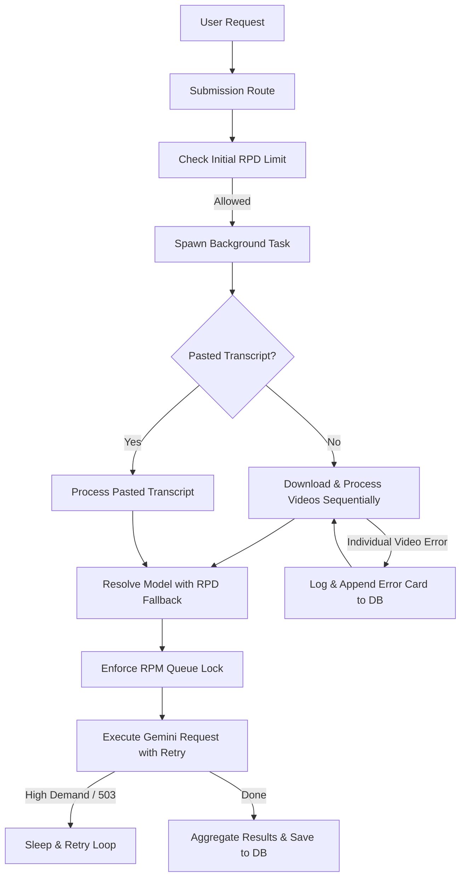

# Architectural & Design Document: Rate Limiting & Error Handling

This document specifies the design, architecture, and workflow definitions for the rate-limiting and error-handling systems implemented in the `rs-summarizer` project.

---

## 1. System Overview

To provide a robust, production-grade summarization backend capable of handling concurrent multi-video requests from different users without overloading Google's Gemini API, we built two main pillars:
1. **Multi-tiered Rate Limiting**: Ensures that Requests Per Minute (RPM) and Requests Per Day (RPD) limits are never exceeded.
2. **Resilient Error Handling**: Handles API demand spikes via intelligent backoff retries, keeps processing batch videos even if individual transcripts fail, and displays raw API errors directly to the user.

---

## 2. Rate Limiting Architecture

The rate limiter operates on two distinct scopes: Requests Per Minute (RPM) and Requests Per Day (RPD). Both are configured per-model in `ModelOption`.

### 2.1 Requests Per Minute (RPM) Locking
To prevent concurrent requests from exceeding a model's RPM limit (which causes instant API errors), we introduced a **cooldown lock queue**.

*   **Design**:
    *   Each model in `AppState` is associated with a shared, thread-safe lock: `Arc<tokio::sync::Mutex<Option<Instant>>>` containing the timestamp of the last executed request.
    *   Before sending a request to Gemini, the background task acquires the mutex for the resolved model.
    *   It calculates the minimum time interval required between requests (`60.0 / rpm_limit` seconds).
    *   If the time elapsed since the last request is shorter than this interval, the thread sleeps for the remaining duration.
    *   The timestamp is updated to the current time, and the lock is released.
*   **Result**: Even if multiple users submit batches concurrently, requests to the same model are neatly serialized and spaced out, guaranteeing the RPM limit is never breached.

### 2.2 Requests Per Day (RPD) Fallback Cascading
If a model hits its daily quota (`rpd_limit`), rather than failing the user's request, the system automatically redirects the query down a defined fallback chain.

*   **Heuristic Baseline**:
    *   **Short Videos (< 30 min)**: Initially select `gemini-3.1-flash-lite`.
    *   **Long Videos (>= 30 min)**: Initially select `gemini-3.5-flash`.
*   **Fallback Chains**:
    *   `gemini-3.5-flash` $\rightarrow$ `gemini-3-flash-preview` $\rightarrow$ `gemini-2.5-flash` $\rightarrow$ `gemini-3.1-flash-lite`.
    *   `gemini-3.1-flash-lite` $\rightarrow$ `gemini-2.5-flash-lite` $\rightarrow$ `gemini-3.5-flash` $\rightarrow$ `gemini-3-flash-preview` $\rightarrow$ `gemini-2.5-flash`.
*   **Check Routine**: The daily limit checks are performed on-the-fly dynamically checking remaining RPD quota. The background task updates the DB model column with the name of the actual model used.

### 2.3 DST-Aware Timezone Reset
Google's Gemini daily API quota resets at midnight Pacific Time (America/Los_Angeles). Since the system is run in Central Europe (CET/CEST), the daily reset happens at **9:00 AM local European time**.

*   **Design**: To avoid discrepancies during Daylight Saving Time (DST) changes, `today_la()` calculates the date by dynamically checking if the current date lies within US PDT transition windows (second Sunday of March to first Sunday of November).
*   **Offset**: It shifts UTC time back by 7 hours (during PDT) or 8 hours (during PST) to match Pacific Time exactly. The reset date transitions perfectly at midnight Pacific time, corresponding to exactly 9:00 AM CET/CEST.

---

## 3. Resilient Error Handling Workflow

Error handling is designed to maximize completion rates for batches and report clear diagnostics.

### 3.1 Inline Failure Tolerance in Batches
When processing multiple YouTube links, the background worker processes the downloads and summaries sequentially.

*   **Design**:
    *   The loop body in `process_summary_inner` is wrapped in an isolated error-handling scope.
    *   If transcript download, validation, or summary generation fails for video $N$, the error is caught.
    *   An error block/card containing the raw error description is appended to the `summary` column in the database (e.g., `### Error for [URL]\n[Error Details]`).
    *   The loop continues to process video $N+1$.
    *   At the end of the batch, `summary_done` is marked as `1` (true) so the user UI correctly displays both the successful summaries and the failed cards without infinite spinning.

### 3.2 High-Demand (503) Retry Loop
Spikes in Gemini API usage can trigger temporary 503 unavailability errors containing:
`"This model is currently experiencing high demand. Spikes in demand are usually temporary. Please try again later."`

*   **Design**:
    *   When an API request returns an error containing `"high demand"`, the backend catches the error.
    *   It implements a 3-attempt loop:
        *   **Attempt 1 fail**: Sleep for **10 minutes** before trying again.
        *   **Attempt 2 fail**: Sleep for **4 hours** before trying again.
        *   **Attempt 3 fail**: Propagate the error and fail that specific video.
    *   *Test Environment Optimization*: In integration or unit tests, the sleeps are scaled down to 10ms and 20ms to prevent CI test suite timeouts.

### 3.3 Raw Error Reporting
Instead of translating error messages into German, the system outputs the raw API error messages (or `yt-dlp` output) directly.
*   **Rationale**: German localized cards hid critical technical detail (such as specific Google billing or auth issues). Presenting the raw, untranslated message allows developers and advanced users to diagnose API quota blocks or YouTube bot-checks instantly.
