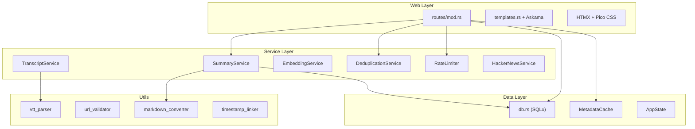

# 🔍 Codebase Review: `rs-summarizer`

**Version:** 0.9.3 · **Language:** Rust (Edition 2021) · **Commits:** 140 · **Active Since:** April 30, 2026  
**Source Lines:** ~5,364 (src/) + ~2,543 (tests/) across 93 `.rs` files  

---

## Executive Summary

`rs-summarizer` is a well-engineered Rust web application that automates YouTube video transcript extraction, AI-powered summarization via Google Gemini, and semantic vector search. The codebase demonstrates strong Rust idioms, a clean layered architecture, and an impressive test suite. However, there are several areas where the project could mature — particularly around configuration management, function decomposition, and minor consistency issues.

> [!TIP]
> **Overall Assessment: B+ / Strong** — Production-quality core with room for polish. The architecture is sound, the test coverage is excellent, and the code is idiomatic Rust.

---

## 1. Architecture & Design

### Layered Architecture

The project follows a clean, well-separated layered design:

| Aspect | Assessment |
|:---|:---|
| **Separation of Concerns** | ✅ Excellent — Web, Service, Data, and Utility layers are cleanly isolated |
| **Async Architecture** | ✅ Proper use of `tokio::spawn` for background tasks; WAL mode for concurrent DB |
| **State Management** | ✅ Thread-safe `Arc<RwLock<...>>` patterns throughout `AppState` |
| **Error Flow** | ✅ "Fail-forward" strategy ensures UI never hangs on background failures |
| **Frontend Strategy** | ✅ HTMX + server-side rendering avoids SPA complexity while staying responsive |

> [!NOTE]
> The HTMX polling mechanism (`hx-trigger="every 1s"`) is particularly well-designed — the `summary_done` flag serves as the single source of truth, stopping polling on both success and failure paths.

### Key Architectural Strengths

1. **Streaming Summary Updates** — Summary text is progressively appended to SQLite using `summary = summary || ?`, enabling real-time HTMX polling of partial results
2. **Model Fallback Chains** — When rate limits are hit, the system automatically falls back to alternative models (`gemini-3.6-flash → gemini-3.5-flash-lite → gemma-4-31b-it`)
3. **Non-Fatal Embeddings** — Embedding failures don't block the overall summarization pipeline
4. **RAII Resource Cleanup** — `TempFileGuard` ensures `/dev/shm` temp files are cleaned up even on panics

---

## 2. Code Quality Analysis

### Module-by-Module Assessment

| Module | LOC | Quality | Key Observation |
|:---|---:|:---:|:---|
| [main.rs](file:///workspace/src/rs-summarizer/src/main.rs) | ~351 | ⚠️ | Overloaded — CLI parsing, viz loading, and server init mixed together |
| [state.rs](file:///workspace/src/rs-summarizer/src/state.rs) | ~216 | ✅ | Clean thread-safe state with proper locking semantics |
| [tasks.rs](file:///workspace/src/rs-summarizer/src/tasks.rs) | ~729 | ⚠️ | `process_summary_inner` is a ~460-line monolith; needs decomposition |
| [db.rs](file:///workspace/src/rs-summarizer/src/db.rs) | ~193 | ✅ | Clean SQL access layer with parameterized queries |
| [models.rs](file:///workspace/src/rs-summarizer/src/models.rs) | ~63 | ✅ | Concise DTOs; `Summary` has 31 fields (large but necessary) |
| [errors.rs](file:///workspace/src/rs-summarizer/src/errors.rs) | ~98 | ✅ | Excellent `thiserror` usage with domain-specific error types |
| [lib.rs](file:///workspace/src/rs-summarizer/src/lib.rs) | ~29 | ✅ | Clean router builder enabling integration test reuse |
| [routes/mod.rs](file:///workspace/src/rs-summarizer/src/routes/mod.rs) | ~266 | ✅ | Well-structured HTMX handlers with deduplication |
| [services/summary.rs](file:///workspace/src/rs-summarizer/src/services/summary.rs) | ~579 | ✅ | Robust streaming with model-specific prompt routing |
| [services/transcript.rs](file:///workspace/src/rs-summarizer/src/services/transcript.rs) | ~500 | ✅ | Good language selection heuristics and RAII cleanup |
| [services/embedding.rs](file:///workspace/src/rs-summarizer/src/services/embedding.rs) | ~182 | ✅ | Clean cosine similarity with Matryoshka truncation support |
| [services/hacker_news.rs](file:///workspace/src/rs-summarizer/src/services/hacker_news.rs) | ~336 | ⚠️ | Compiles regexes on every call; should use `OnceLock` |
| [services/nn_mapper.rs](file:///workspace/src/rs-summarizer/src/services/nn_mapper.rs) | ~89 | ⚠️ | Uses `unsafe impl Send/Sync` — needs verification |
| [services/rate_limiter.rs](file:///workspace/src/rs-summarizer/src/services/rate_limiter.rs) | ~185 | ✅ | Custom DST-aware date logic; TOCTOU race risk on limits |
| [cache.rs](file:///workspace/src/rs-summarizer/src/cache.rs) | ~240 | ✅ | Smart `substr(summary, 1, 200)` preview optimization |
| [utils/vtt_parser.rs](file:///workspace/src/rs-summarizer/src/utils/vtt_parser.rs) | ~249 | ✅ | Efficient character-level tag stripping; Python-compatible |
| [utils/url_validator.rs](file:///workspace/src/rs-summarizer/src/utils/url_validator.rs) | ~274 | ⚠️ | Regex compiled in loop; use `OnceLock` for caching |
| [utils/markdown_converter.rs](file:///workspace/src/rs-summarizer/src/utils/markdown_converter.rs) | ~107 | ✅ | Clever YouTube censorship avoidance with TLD dot replacement |
| [utils/timestamp_linker.rs](file:///workspace/src/rs-summarizer/src/utils/timestamp_linker.rs) | ~155 | ⚠️ | Time regex may false-match CSS ratios like `16:9` |

### Rust Idioms & Patterns

| Pattern | Usage | Assessment |
|:---|:---|:---:|
| `thiserror` for error enums | Across all domain errors | ✅ |
| `anyhow` for application errors | In `main.rs` binary entry | ✅ |
| `Arc<RwLock<...>>` for shared state | `AppState` fields | ✅ |
| `tokio::spawn` for background work | Task pipeline | ✅ |
| RAII guards | `TempFileGuard` for cleanup | ✅ |
| Compile-time templates | Askama templates | ✅ |
| Property-based testing | `proptest` for URL/VTT | ✅ |

---

## 3. Identified Issues

### 🔴 High Priority

| # | Issue | Location | Impact |
|:--|:------|:---------|:-------|
| 1 | **`process_summary_inner` is a ~460-line monolith** with duplicate branches for YouTube, HN, and paste modes | [tasks.rs](file:///workspace/src/rs-summarizer/src/tasks.rs) | Maintainability risk; hard to test individual branches |
| 2 | **`assert!` panic in `cosine_similarity`** on empty vectors — will crash in production | [embedding.rs](file:///workspace/src/rs-summarizer/src/services/embedding.rs) | Production crash risk |
| 3 | **Blocking `std::fs::read_to_string`** inside async function `load_viz_data` | [main.rs](file:///workspace/src/rs-summarizer/src/main.rs) | Could block Tokio runtime thread |

### 🟡 Medium Priority

| # | Issue | Location | Impact |
|:--|:------|:---------|:-------|
| 4 | **Regex compiled on every call** in `clean_html_to_text`, `validate_youtube_url`, and `validate_hn_url` | [hacker_news.rs](file:///workspace/src/rs-summarizer/src/services/hacker_news.rs), [url_validator.rs](file:///workspace/src/rs-summarizer/src/utils/url_validator.rs) | Performance overhead on hot paths |
| 5 | **Hardcoded model configurations** requiring recompilation to update pricing/limits | [state.rs](file:///workspace/src/rs-summarizer/src/state.rs) | Operational friction |
| 6 | **Hardcoded network address** `127.0.0.1:5001` — not configurable via env vars | [main.rs](file:///workspace/src/rs-summarizer/src/main.rs) | Deployment inflexibility |
| 7 | **TOCTOU race** in rate limiter — `check_rate_limit` and `increment_counter` are separate operations | [rate_limiter.rs](file:///workspace/src/rs-summarizer/src/services/rate_limiter.rs) | Could allow slightly over-limit under concurrency |
| 8 | **`unsafe impl Send/Sync`** for `NnMapper` — needs audit of `FittedUmap` internals | [nn_mapper.rs](file:///workspace/src/rs-summarizer/src/services/nn_mapper.rs) | Potential undefined behavior |
| 9 | **Token count fallback** uses `len / 4` estimation which is inaccurate for non-ASCII text | [summary.rs](file:///workspace/src/rs-summarizer/src/services/summary.rs) | Cost estimation inaccuracy |

### 🟢 Low Priority / Polish

| # | Issue | Location | Impact |
|:--|:------|:---------|:-------|
| 10 | **Language inconsistency** — German error messages (`"Fehler: Der eingegebene Wert..."`) mixed with English | [routes/mod.rs](file:///workspace/src/rs-summarizer/src/routes/mod.rs), [errors.rs](file:///workspace/src/rs-summarizer/src/errors.rs), [main.rs](file:///workspace/src/rs-summarizer/src/main.rs) | User confusion |
| 11 | **Template render errors silently swallowed** via `unwrap_or_default()` | [routes/mod.rs](file:///workspace/src/rs-summarizer/src/routes/mod.rs) | Hidden failures |
| 12 | **Timestamp regex false positives** — could match CSS patterns like `16:9` | [timestamp_linker.rs](file:///workspace/src/rs-summarizer/src/utils/timestamp_linker.rs) | Minor UI glitch |
| 13 | **Heading regex** only matches at string start (missing `(?m)` multiline flag) | [markdown_converter.rs](file:///workspace/src/rs-summarizer/src/utils/markdown_converter.rs) | Headings after newlines not converted |
| 14 | **`DeduplicationService` instantiated per-request** instead of stored in `AppState` | [routes/mod.rs](file:///workspace/src/rs-summarizer/src/routes/mod.rs) | Minor allocation overhead |
| 15 | **Page size hardcoded** to 20 in `fetch_browse_page` | [db.rs](file:///workspace/src/rs-summarizer/src/db.rs) | Inflexible pagination |
| 16 | **`/dev/shm` path** is Linux-specific | [transcript.rs](file:///workspace/src/rs-summarizer/src/services/transcript.rs) | Cross-platform limitation |
| 17 | **Manual CLI arg parsing** instead of using `clap` | [main.rs](file:///workspace/src/rs-summarizer/src/main.rs) | Maintenance burden |

---

## 4. Test Coverage

The test suite is a significant strength of this project:

| Suite | File | Tests | Scope |
|:---|:---|---:|:---|
| Unit Tests | Embedded in `src/` modules | ~60+ | VTT parsing, URL validation, markdown, cost calc, rate limits |
| Pipeline Integration | [integration_pipeline.rs](file:///workspace/src/rs-summarizer/tests/integration_pipeline.rs) | ~15 | Full pipeline: download → summarize → embed |
| Transcript Integration | [integration_transcript.rs](file:///workspace/src/rs-summarizer/tests/integration_transcript.rs) | ~4 | External yt-dlp interaction |
| Browser Integration | [integration_browser.rs](file:///workspace/src/rs-summarizer/tests/integration_browser.rs) | ~20+ | WebDriver E2E with HTMX polling, WCAG a11y |
| Property-Based | Via `proptest` crate | Various | Fuzz testing URL and VTT parsers |

> [!IMPORTANT]
> The browser integration tests are exceptionally thorough — testing HTMX polling lifecycle, WCAG accessibility (`aria-busy`, `<label>` associations), keyboard navigation, concurrent submissions, and even server restart recovery.

### Test Architecture Strengths
- ✅ In-memory SQLite (`sqlite::memory:`) for isolation
- ✅ Graceful handling of API rate limits in CI (skip vs. fail)
- ✅ Ground-truth fixture testing (VTT parser byte-exact match with Python implementation)
- ✅ Clean per-test server isolation in browser tests

### Test Improvement Opportunities
- ⚠️ Hardcoded geckodriver ports (4444-4468) could collide under parallel execution
- ⚠️ Heavy `tokio::time::sleep` usage for DOM sync — explicit `wait_for` conditions would be faster
- ⚠️ Some duplicate error-matching strings across tests could be shared utilities

---

## 5. Security Considerations

| Area | Status | Notes |
|:---|:---:|:---|
| SQL Injection | ✅ Safe | All queries use `?` parameter binding via SQLx |
| XSS Protection | ✅ Good | Askama auto-escapes; `\|safe` filter used only for trusted internal HTML |
| Input Validation | ✅ Strong | YouTube URL validation enforces HTTPS, 11-char ID format |
| Dependency Auditing | ⚠️ Unknown | No `cargo audit` or `cargo deny` configuration found |
| API Key Management | ✅ OK | Loaded via environment variable, not hardcoded |
| HTML Sanitization | ⚠️ Gap | `render_markdown_to_html` passes raw HTML through; consider `ammonia` crate |
| Rate Limiting | ✅ Present | Per-model daily quotas with timezone-aware resets |

---

## 6. Dependency Analysis

The project has a moderate dependency footprint:

| Category | Dependencies | Assessment |
|:---|:---|:---:|
| **Web** | `axum 0.8`, `tower-http 0.6` | ✅ Current |
| **Async** | `tokio 1.52` (full features) | ✅ Current |
| **Database** | `sqlx 0.9` (sqlite, macros) | ✅ Current |
| **AI** | `gemini-rust 1.7.1` | ✅ Active crate |
| **Templating** | `askama 0.16` | ✅ Current |
| **GPU/ML** | `burn 0.20.1`, `cubecl 0.9.0`, `fast-umap 1.6.0` | ⚠️ Pinned exact versions |
| **Frontend** | HTMX 2.0.2, Pico CSS (vendored) | ✅ Self-contained |

> [!WARNING]
> The GPU-related dependencies (`burn`, `cubecl`, `fast-umap`) are pinned with `=` exact version requirements. This prevents automatic minor/patch updates and could cause resolution conflicts in the workspace.

---

## 7. Project Extras

The project includes several noteworthy companion components:

| Component | Purpose |
|:---|:---|
| **Browser Extension** ([extension/](file:///workspace/src/rs-summarizer/extension)) | Chrome/Firefox extension for sending URLs to the backend |
| **Viz Tool** ([viz-tool/](file:///workspace/src/rs-summarizer/viz-tool)) | GPU-accelerated UMAP visualization of embedding space |
| **Export Scripts** ([scripts/](file:///workspace/src/rs-summarizer/scripts)) | DB migration, backup, release automation, synthetic data generation |
| **Systemd Service** ([rs-summarizer.service](file:///workspace/src/rs-summarizer/rs-summarizer.service)) | Production deployment unit file |

---

## 8. Recommendations Summary

### Quick Wins (Low Effort, High Impact)

1. **Cache compiled regexes** with `std::sync::OnceLock` in `url_validator.rs`, `hacker_news.rs`, and `markdown_converter.rs`
2. **Replace `assert!` with `Result`** in `cosine_similarity` to prevent production panics
3. **Use `tokio::fs::read_to_string`** instead of `std::fs::read_to_string` in async context
4. **Standardize language** — pick English for all user-facing strings and error messages

### Strategic Improvements (Higher Effort)

5. **Decompose `process_summary_inner`** into smaller functions: `fetch_youtube_content()`, `fetch_hn_content()`, `run_model_pipeline()`, `finalize_output()`
6. **Externalize model configurations** to a JSON/YAML config file or environment variables
7. **Make host/port configurable** via `HOST` and `PORT` environment variables
8. **Add `cargo audit`** to CI pipeline and consider `cargo deny` for license compliance
9. **Add HTML sanitization** (e.g., `ammonia` crate) for rendered markdown before `|safe` output

### Architecture Evolution

10. **Consider `clap`** for CLI argument parsing as the `export-db` command grows
11. **Store services in `AppState`** instead of instantiating `DeduplicationService` per request
12. **Evaluate SQLite vector extensions** (e.g., `sqlite-vec`) to replace brute-force similarity search as the dataset grows
13. **Add structured logging** with `tracing` spans for better observability of the pipeline stages

---

> [!NOTE]
> This review is based on source analysis as of commit `109cba1` (v0.9.3+1). The codebase is in active development and several of the issues noted may already be on the roadmap.
