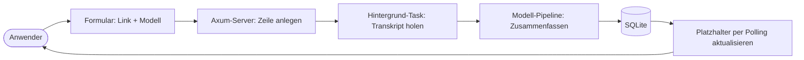
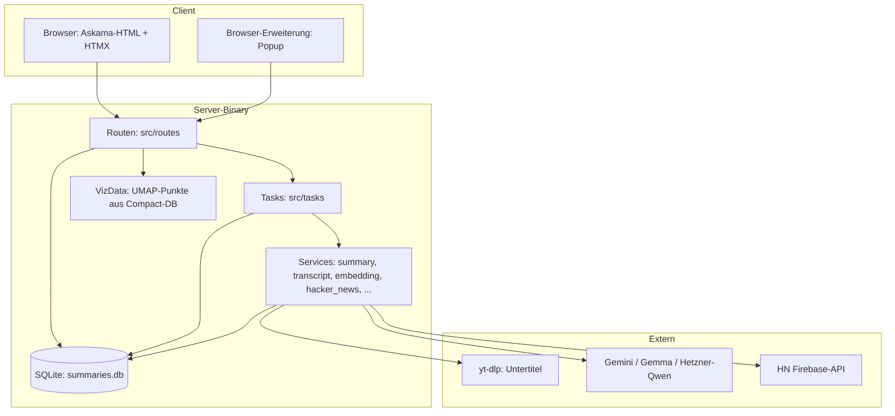
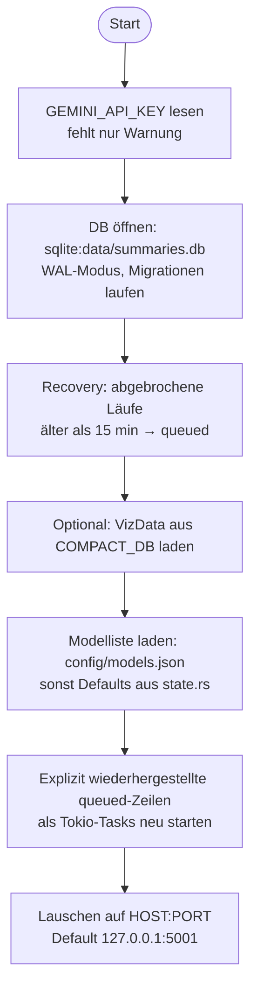
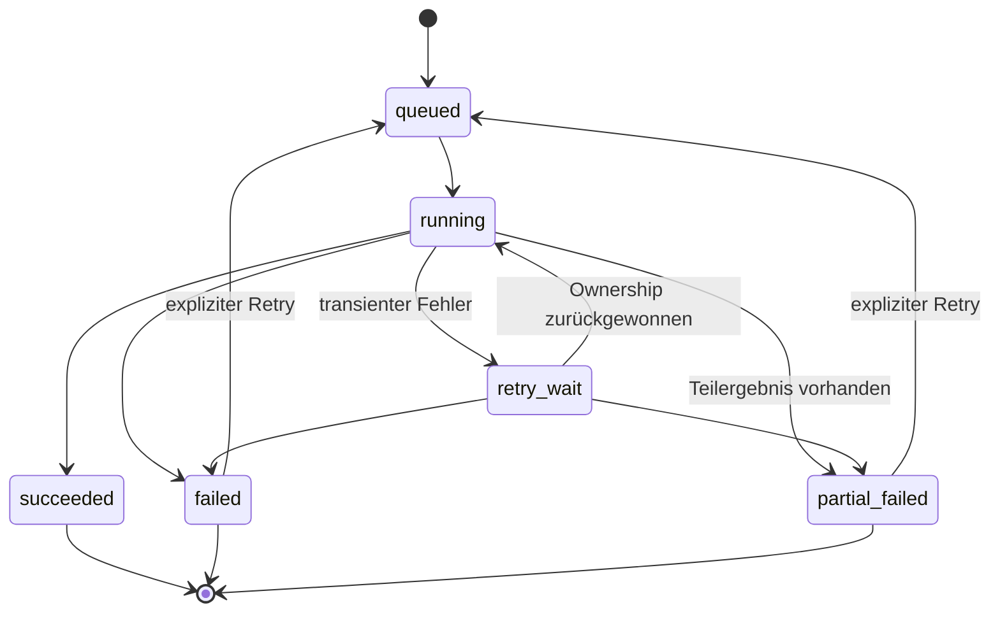
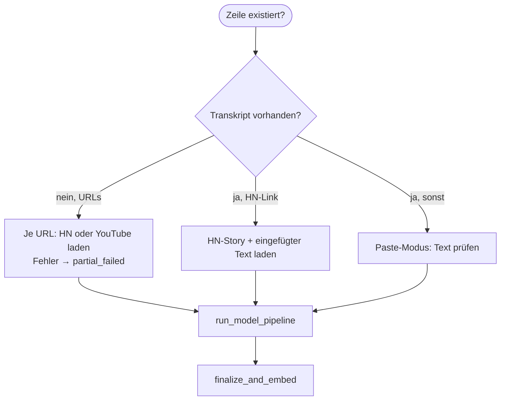

# rs-summarizer: Architektur-Dokumentation

Diese Dokumentation beschreibt den Code in diesem Projekt (`rs-summarizer`,
Stand Version 1.8.0): was die Software tut, wie sie aufgebaut ist und wie die
Teile zusammenarbeiten. Sie liegt unter `plan/20260920_01_doc/doc.md` und ist
auf Deutsch geschrieben. Diagramme nutzen Mermaid, Formeln MathJax — beides
zeigt GitHub nativ an.

**Leserführung.** § 1 sagt, was das Programm für Anwender tut. § 2 zeigt das
Gesamtsystem als Diagramm. §§ 3–4 erklären Startvorgang und HTTP-Schicht.
§§ 5–6 sind das Herzstück: der persistierte Generierungs-Lebenszyklus und die
Zusammenfassungs-Pipeline. §§ 7–8 behandeln Kosten/Limits und das Datenmodell.
§§ 9–10 Darstellung, Suche und Visualisierung. § 11 Betrieb, § 12 Tests,
§ 13 Abhängigkeiten, § 14 offene Punkte.

**Scope.** Abgedeckt sind Server (`src/`), Datenbank (`migrations/`),
Templates, Browser-Erweiterung (`extension/`) und das Visualisierungs-Tool
(`viz-tool/`) im Überblick. Nicht abgedeckt sind die Prompt-Texte im Detail
(`prompts/`) und die Einzelheiten der Wanderungen durch alte Pläne (`plan/`).

---

## 1. Überblick: Was das Programm tut

`rs-summarizer` beantwortet eine einzige Frage — *„Was steht in diesem Video
bzw. dieser Diskussion, ohne dass ich alles ansehen muss?"* — und beantwortet
sie als Webseite: Man fügt einen YouTube-Link, einen Hacker-News-Link oder
einfach Text ein, wählt ein Sprachmodell, und erhält eine strukturierte
Zusammenfassung mit Zeitstempeln, Glossar und Kostenabrechnung.

Die Eingabequellen sind drei:

| Quelle | Erkennung | Beschaffung |
|---|---|---|
| YouTube-URL oder Video-ID | `utils/url_validator.rs` | `TranscriptService` lädt per `yt-dlp` Untertitel (VTT), bevorzugt en → de → fr → … |
| Hacker-News-URL oder Item-ID | `validate_hn_url` | `HackerNewsService` holt Story, Kommentare und verlinkten Artikel über die Firebase-API |
| Eingefügter Text („Paste") | Transkript-Feld nicht leer | Direktübernahme, Längenprüfung 30–280.000 Wörter |

Die Zusammenfassung erzeugt ein externes Sprachmodell (Google Gemini, Gemma
oder ein OpenAI-kompatibler Hetzner-Endpunkt mit Qwen). Weil Modellaufrufe
Sekunden bis Minuten dauern, läuft die Erzeugung **asynchron im Hintergrund**:
Die Webseite antwortet sofort mit einem Platzhalter, der per HTMX jede Sekunde
nach dem Stand fragt („Polling"), bis das Ergebnis da ist.

## 2. Systemüberblick

Der Server ist ein einzelnes Rust-Binary (Tokio + Axum). Alle langlebigen
Zustände liegen in einer SQLite-Datei (`data/summaries.db`, WAL-Modus); alles
Flüchtige (Zähler, Locks, Deduplikation) im `AppState`. Externe Systeme sind
`yt-dlp` (Untertitel), die Modell-APIs (Gemini/Hetzner) und die HN-API.

Modulkarte (`src/`): `main.rs` startet alles; `lib.rs` verdrahtet den Router;
`state.rs` definiert `AppState` und die Modelliste; `routes/` nimmt HTTP an;
`tasks.rs` orchestriert die Pipeline; `services/` kapselt je ein Außen- oder
Querschnittsthema; `db.rs` ist die einzige Stelle mit SQL; `generation.rs`
definiert die Lebenszyklus-Regeln; `models.rs` die Datenformen; `utils/`
kleine Helfer (Markdown, VTT, Zeitstempel-Links, URL-Prüfung); `templates.rs`
bindet Askama-Templates an; `commands/export_db.rs` ist ein CLI-Unterbefehl;
`cache.rs` ein In-Memory-Metadaten-Cache.

## 3. Startvorgang und `AppState`

`main.rs` kennt zwei Betriebsarten: `export-db` (reiner CLI-Export, siehe
§ 11) und den Normalbetrieb als Webserver. Der Start folgt einer festen
Reihenfolge:

Der geteilte Zustand `AppState` (`src/state.rs`) enthält: die DB-Verbindung,
die Modelliste (`model_options`), Tageszähler pro Modell (`model_counts` +
`last_reset_day`, Zeitzone America/Los_Angeles), den API-Schlüssel, pro-Modell
Mutexe für Minuten-Limits (`model_locks`), den `DeduplicationService`
(5-Minuten-Fenster), den `DownloadLimiter` (max. parallele `yt-dlp`/HN-Abrufe)
und optional die Visualisierungsdaten (`viz_data`) bzw. den NN-Mapper
(Feature `nn-mapper`).

Zwei Start-Details sind bewusst defensiv: Fehlende `GEMINI_API_KEY` verhindert
den Start nicht (Anfragen schlagen erst später fehl), und nach einem Neustart
werden nur explizit als unterbrochen markierte Zeilen fortgesetzt — nie der
gesamte historische `queued`-Rückstau (`fetch_queued_generations` filtert auf
`network_interrupted`). Beim Herunterfahren setzt der Server einen
WAL-Checkpoint und schließt den Pool sauber.

---

## 4. HTTP-Schicht: Routen, Formulare, Polling

Der Router (`src/lib.rs`, `build_router`) meldet sieben Endpunkte an —
bewusst wenige, alle als HTML statt JSON, weil das Frontend serverseitig
gerenderte Templates mit HTMX nachlädt:

| Methode | Pfad | Handler | Zweck |
|---|---|---|---|
| GET | `/` | `index` | Startseite mit Eingabeformular und Modellauswahl |
| POST | `/process_transcript` | `process_transcript` | Einreichung prüfen, deduplizieren, Zeile anlegen, Hintergrund-Task starten |
| POST | `/generations/{id}` | `get_generation` | Polling-Stand einer Generierung (HTMX, jede Sekunde) |
| POST | `/generations/{id}/retry` | `retry_generation` | Expliziter Neustart einer terminalen Generierung |
| GET | `/browse` | `browse_summaries` | Blättern durch fertige Zusammenfassungen (20 pro Seite) |
| POST | `/summaries/{id}/rate` | `submit_rating` | Sternebewertung (1–5) für Zusammenfassung und Inhalt |
| POST | `/search` | `search_similar` | Ähnlichkeitssuche über Embeddings (Top 10) |

`POST /process_transcript` ist der wichtigste Ablauf: Modell aus der Liste
prüfen, Thinking-Stufe validieren (benannte Stufen nur bei `gemini-3.*`),
Tageslimit prüfen, Link oder Text verlangen, URLs normieren (YouTube vs. HN
vs. ungültig), mehrere URLs in Einzelaufträge aufspalten (Transkript aus dem
Formular gehört dabei nur zum ersten), Duplikate im 5-Minuten-Fenster
wiederverwenden statt neu anlegen, sonst Zeile einfügen und pro Auftrag einen
Tokio-Task starten. Die Antwort ist sofort ein HTML-Schnipsel
(`GenerationPartialTemplate`), der sich selbst per `hx-trigger="every 1s"`
aktualisiert, bis der Status terminal ist — dann zeigt derselbe Schnipsel das
Ergebnis, den Fehler (`role="alert"`) oder den Retry-Knopf.

Bewertungen sind pro Client-IP entdoppelt (`upsert_rating`): Dieselbe IP kann
ihre Sterne aktualisieren, aber nicht mehrfach abstimmen. Die Client-IP wird
dabei aus `x-forwarded-for` bzw. `x-real-ip` gelesen, sonst aus der
Socket-Adresse — wichtig hinter einem Reverse-Proxy.

---

## 5. Generierungs-Lebenszyklus: eine persistente State-Machine

Jede Zusammenfassungszeile trägt einen Generierungszustand. Die Regeln stehen
in `src/generation.rs`, die Durchsetzung in `db::transition_generation` als
atomares Compare-and-Set in SQL (`UPDATE … WHERE status = ?` + Prüfung auf
genau eine betroffene Zeile). Dadurch kann kein doppelter Worker und kein
verlorener Retry dieselbe Zeile gleichzeitig besitzen — der Verlierer des
Rennens bekommt `false` zurück und beendet sich still.

Die Zustände bedeuten: `queued` wartet auf einen Worker; `running` gehört
genau einem Task; `retry_wait` parkt zwischen zwei Versuchen (mit
`next_retry_at`-Zeitstempel); `succeeded`/`failed`/`partial_failed` sind
terminal. `partial_failed` heißt: Es liegt bereits Text vor (z. B. ein
abgebrochener Stream), der als Diagnose-Entwurf erhalten bleibt, aber nicht
als fertig veröffentlicht wird.

Zwei Mechanismen schützen vor Geister-Effekten: Jede Übergabe an einen neuen
Versuch erhöht die **Epoche** (`generation_epoch`); Streaming-Chunks werden
nur geschrieben, wenn Epoche und Status noch passen
(`append_summary_chunk_for_epoch`) — ein verspäteter Stream aus einem
abgebrochenen Versuch kann so keinen Retry-Text mehr überschreiben. Und
`provider_interaction_id` hält die Anbieter-Interaktion nachvollziehbar.

Transiente Anbieterfehler (Überlast/503, Verbindungsabbruch, abgebrochener
Stream) parken maximal $MAX = 3$ Versuche lang in `retry_wait` mit
exponentiell wachsender Pause:

$$
delay(a) = \min(30 \cdot 2^{a},\, 600)\ \text{Sekunden},\quad a = 1, 2, 3
$$

also 60 s, 120 s, 240 s. Quotenfehler (429/`RESOURCE_EXHAUSTED`) gehen nicht
in Retry, sondern auf das nächste Modell der Fallback-Kette (§ 6). Alle
übrigen Fehler werden terminal und bekommen einen öffentlichen Fehlercode
(`PublicErrorCode`: `unavailable`, `rate_limited`, `network_interrupted`,
`provider_aborted`, `incomplete_output`, `safety_refusal`, `invalid_request`,
`internal`) mit Anwendertext statt Anbieter-Detail.

---

## 6. Pipeline: vom Link zum Embedding

`process_summary_inner` (`src/tasks.rs`) unterscheidet drei Eingangswege und
führt sie auf dieselbe Modell-Pipeline zusammen:

**Beschaffung.** YouTube läuft über `TranscriptService`: Untertitel auflisten,
beste Sprache nach Priorität wählen, VTT laden, parsen, Temp-Dateien per Guard
aufräumen — begrenzt durch den Download-Limiter. HN läuft über
`HackerNewsService`: Story-Metadaten, Kommentarbaum und verlinkter Artikel
werden zu einem Gesamttext verbunden. Mehrere URLs werden sequenziell
abgearbeitet und token-/kostenseitig aufsummiert; scheitert ein Element,
scheitert das Aggregat (kein stilles Teil-Publizieren).

**Modellauswahl.** `model == "auto"` wählt heuristisch: kurze HN-Texte
($< 15000$ Wörter) und kurze Videos ($< 1800$ s Dauer, ersatzweise
Wortzahl $\cdot 2/5$ Sekunden) bekommen das sparsame
`gemini-3.5-flash-lite`, längere `gemini-3.6-flash`. Danach läuft die
Fallback-Kette aus `get_fallback_chain`: Jedes Modell wird auf sein
Tageslimit geprüft, übersprungene Modelle protokolliert, der tatsächlich
verwendete Name in die Zeile zurückgeschrieben.

**Begrenzungen.** Zwei Ebenen schützen vor Quotenverbrauch: Tageslimits
(`rpd_limit`, Zähler in `AppState`, Reset um Mitternacht
America/Los_Angeles) und Minutenlimits (`rpm_limit`) als pro-Modell-Mutex mit
Mindestabstand zwischen zwei Aufrufen:

$$
warte = \max\left(0,\ \frac{60}{RPM} - vergangen\right)
$$

**Erzeugung.** `SummaryService` schickt Systemanweisung plus je ein
Eingabe-/Ausgabe-Beispiel aus `prompts/` (Few-Shot) und den Transkripttext an
das Modell, liest den Stream ereignisweise (`InteractionAccumulator`: Text-,
Thinking- und Nutzungs-Events) und schreibt Chunks epochen-gesichert in die
DB. Die Thinking-Stufe (`auto/minimal/low/medium/high`, Default `high`) wird
nur bei Gemini-3-Modellen als benannte Stufe übertragen, sonst weggelassen —
ein Fallback auf ein älteres Modell „downgradet" die Stufe stillschweigend mit
Warnung statt zu scheitern. Grounding-Schalter (`google_search_grounding`,
`url_context`) und Glossar/Sprache reisen als Parameter mit.

**Abschluss.** `finalize_and_embed` setzt Tokenzähler, Thinking-Text, Kosten
und Endzeitpunkt, erzeugt die YouTube-formatierte Zeitstempel-Variante
(`convert_markdown_to_youtube_format`) und bettet die Zusammenfassung mit
`gemini-embedding-001` (3072 Dimensionen) ein — als Little-Endian-BLOB in der
Zeile. Einbettungsfehler sind nur Warnungen: Die Zusammenfassung gilt auch
ohne Vektor als fertig.

---

## 7. Kosten und Limits: die Preisrechnung

Jede fertige Zusammenfassung speichert Eingabe-/Ausgabe-/Thinking-Token und
die daraus berechneten Kosten. Die Formel nutzt die Preise des tatsächlich
verwendeten Modells (`input_price_per_mtoken`, `output_price_per_mtoken` in
USD pro Million Token):

$$
kosten = \frac{in \cdot p_{in} + (out + thinking) \cdot p_{out}}{10^6}
$$

Die Modelliste (`config/models.json`, Fallback `get_default_models` in
`state.rs`) führt je Modell Kontextfenster, `rpm_limit` (Anfragen/Minute) und
`rpd_limit` (Anfragen/Tag) — z. B. `gemini-3.6-flash` mit 5/min und 20/Tag,
`gemini-3.5-flash-lite` mit 15/min und 500/Tag, die Hetzner-Qwen-Modelle mit
60/min und 14400/Tag bei Preis 0. Drei Architekturen (`Gemini`, `Gemma`,
`Hetzner`) steuern, welcher Client-Pfad (natives Gemini-SDK vs.
OpenAI-kompatibel) und welche Thinking-Stufen gelten. Die Tiefenanalyse dieser
Begrenzungen steht zusätzlich in `doc/rate_limiting_error_handling_architecture.md`.

## 8. Datenmodell: eine Tabelle trägt fast alles

`db.rs` ist die einzige Stelle mit SQL; `init_db` öffnet den Pool (max. 5
Verbindungen, WAL-Modus) und fährt die Migrationen `001–009` hoch. Die
Tabelle `summaries` trägt pro Auftrag rund 50 Spalten in vier Gruppen:

- **Auftrag:** `identifier`, `model`, `original_source_link`, `transcript`,
  `host`, Optionen (Kommentare, Zeitstempel, Glossar, Sprache, Grounding,
  URL-Kontext, Thinking-Stufe), `rs_summarizer_version` (Provenienz: welche
  Binary-Version hat diese Zeile erzeugt).
- **Lebenszyklus:** `generation_status`, `generation_attempt`,
  `generation_epoch`, Zeitstempel, `next_retry_at`, Fehlercode + -text,
  `provider_interaction_id` (Migration `007`, Vorheriges wird als
  `succeeded`/`queued` eingeordnet; `008` quarantäniert Alt-`queued`-Rückstau).
- **Ergebnis:** `summary`, `summary_done`, Tokenzähler, `cost`, Thinking-Text,
  Zeitstempel-Varianten (`timestamps`, YouTube-Format).
- **Suche:** `embedding` (+ `embedding_model`, `full_embedding`) als BLOBs.

Daneben gibt es nur kleine Nebentabellen (Ratings mit
`client_ip`-Entduplizierung, Dedup-Index aus Migration `003`). Der
`MetadataCache` (`cache.rs`) hält eine leichte In-Memory-Kopie (ID, Modell,
Kosten, Link, Vorschau der ersten 200 Zeichen) für schnelles Blättern.

## 9. Darstellung: Server-Templates, HTMX, Erweiterung

Das Frontend kommt ohne Build-Schritt aus: Askama-Templates (`templates/`,
Typen in `src/templates.rs`) rendern HTML auf dem Server, `static/` liefert
HTMX und Pico.css aus. Markdown wird mit `pulldown-cmark` zu HTML
(`markdown_renderer`), Zeitstempel im Text werden zu klickbaren YouTube-Links
mit Sekunden-Parameter (`timestamp_linker`, z. B. `t=3723s`). Der
Generierungs-Schnipsel (`generation_partial.html`) ist zugleich Ladeanzeige,
Ergebnis, Fehlerbox und Retry-Knopf — gesteuert allein über den
`generation_status`.

Die Browser-Erweiterung (`extension/`, Chrome + Firefox) ist ein dünner
Client: Popup mit Modellwahl und Server-URL, schickt die aktuelle Seite an
`POST /process_transcript` und fragt per Polling den Stand ab. Sie dupliziert
keine Logik — Fälligkeiten, Fehler und Kosten bleiben Serverseite.

## 10. Suche und Visualisierung

**Ähnlichkeitssuche** (`POST /search`): Der Suchtext wird mit demselben
Embedding-Modell eingebettet, dann vergleicht `find_similar` den
Kosinus-Abstand zu allen gespeicherten Vektoren in Rust (kein Vektor-Index,
linearer Scan mit Top-10-Auswahl):

$$
sim(a,b) = \frac{a \cdot b}{\lVert a\rVert\,\lVert b\rVert},\quad
0\ \text{bei leerem oder Null-Vektor}
$$

Unterschiedliche Vektorlängen werden auf die kürzere gekappt
(Matryoshka-Verhalten). Das erklärt die Architekturgrenze ehrlich: Bei vielen
Zehntausend Zusammenfassungen wird dieser Scan zum Flaschenhals — dann gehört
hier ein ANN-Index (z. B. sqlite-vss) hin.

**Visualisierung:** Ist `COMPACT_DB_PATH` gesetzt, lädt der Server beim Start
read-only UMAP-2D-Punkte, DBSCAN-Clusterlabels und Cluster-Titel aus einer
kompakten DB und berechnet Centroide (`VizData`). Erzeugt wird diese
Kompakt-DB vom Schwester-Tool `viz-tool/` (Embeddings → UMAP via `fast-umap`
→ Clustering → Titel per Gemini; siehe `viz-tool/AGENTS.md`). Der optionale
NN-Mapper (`services/nn_mapper.rs`, Feature `nn-mapper`) projiziert neue
Punkte ohne Neuberechnung.

## 11. Betrieb: Service, Umgebungen, Export

- **Systemd:** `rs-summarizer.service` startet das Binary nach dem Netzwerk,
  mit Arbeitsverzeichnis, `.env`-Datei und automatischem Neustart.
- **Umgebung:** `GEMINI_API_KEY` (Modellzugang), `HOST`/`PORT` (Default
  `127.0.0.1:5001`), `MODELS_CONFIG_PATH` (Modelliste statt
  `config/models.json`), `COMPACT_DB_PATH` (Visualisierung),
  `INTEGRATION_TEST`/`TEST_MODE` (verkürzte Retry-Pausen in Tests).
- **Export:** `rs-summarizer export-db --source … --output …` kopiert die DB
  (`commands/export_db.rs`), optional mit Embeddings und Kompression — der
  Weg, wie Kompakt-DBs für die Visualisierung entstehen.
- **Skripte:** `scripts/` enthält Release-, Backup- und Migrations-Helfer
  sowie `create_synthetic_db.py` für Testdaten.

## 12. Tests: Ebenen und Konventionen

- **Unit-Tests** liegen bei den Modulen (`state.rs`: Modellpreis-Checks;
  `tasks.rs`: Dauer-Schätzung, Fallback-Ketten, Fehlerklassifizierung;
  `generation.rs`: Zustandsübergänge, Retry-Endlichkeit; `models.rs`:
  Thinking-Serienformat).
- **Routen-Tests** (`routes/mod.rs`) fahren gegen In-Memory-SQLite:
  Multi-URL-Aufspaltung, Dedup, Ablehnung ungültiger URLs, Thinking-Validierung.
- **Integration** (`tests/integration_*.rs`): Pipeline, Transkripte, Ratings
  und Browser-Flows (letztere brauchen WebDriver/Chromium).
- **Crate-fremd:** `viz-tool/` hat eigene Tests inkl. Proptest-Regressionen.
- Konvention: Neue Fehlerfälle bekommen erst einen Unit-Test auf
  Prädikat-Ebene (`is_summary_rate_limited`, Ketten-Mitgliedschaft), dann
  Routen-/Integrationstests — reine `unwrap`-Pfade auf E/A-Wegen sind
  unerwünscht (Fehler sind Werte, siehe § 5).

## 13. Abhängigkeiten: GitHub-Herkunft

Keine neuen Dependencies wurden eingeführt (reine Dokumentationsarbeit). Die
tragenden Fremd-Crates mit ihren GitHub-Organisationen (DeepWiki-fähige
`org/projekt`-Form):

| Crate | GitHub `org/projekt` | Rolle |
|---|---|---|
| tokio | tokio-rs/tokio | Async-Laufzeit, Tasks, Timeouts |
| axum | tokio-rs/axum | HTTP-Router und Handler |
| sqlx | launchbadge/sqlx | SQLite-Pool, Migrationen |
| gemini-rust | flachesis/gemini-rust | Gemini-API (Zusammenfassen, Einbetten) |
| async-openai | openai-rs/async-openai | OpenAI-kompatibler Pfad (Hetzner-Qwen) |
| askama | djc/askama | Server-Templates |
| serde / serde_json | serde-rs/serde, serde-rs/json | Formulare, Config, API-Typen |
| reqwest | seanmonstar/reqwest | HN-API, Artikel-Abruf |
| pulldown-cmark | pulldown-cmark/pulldown-cmark | Markdown → HTML |
| tower-http | tower-rs/tower-http | Static-Files |
| chrono | chronotope/chrono | Zeitstempel, Tageslimits |
| fantoccini (+ Chromedriver) | jonhoo/fantoccini | Browser-Integrationstests |
| proptest / tempfile | proptest-rs/proptest, Stebalien/tempfile | Property-/Datei-Tests |

Externe Programme (keine Crates, aber Laufzeit-Voraussetzungen): `yt-dlp`
(Untertitel), `ffmpeg`-nahe Helfer je nach Einsatz, Chromium nur für
Browser-Tests. GUI-/Umap-Stack (`eframe`, `egui_plot`, `fast-umap`, `burn`,
`ndarray`, `linfa`) gehört zu `viz-tool/` (siehe `viz-tool/deps.md`).

Hinweis: In dieser Session war kein DeepWiki-MCP-Werkzeug verfügbar; die
Recherche erfolgte direkt an den Quellen (siehe `walkthrough.md`). Künftige
Abfragen lassen sich aus obiger Tabelle bauen, z. B.
`repoName="launchbadge/sqlx"` zur Pool-/Migrationsnutzung.

## 14. Vorschlag-Box: was beim Schreiben auffiel

Umgesetzt statt nur vorgeschlagen: Zustandsdiagramm des Lebenszyklus (§ 5)
und Sequenz des Einreichungsablaufs (§ 1) als Mermaid; Preis-, Warte-,
Retry- und Kosinus-Formeln als MathJax statt Prosa. Noch offen
(Vorschläge, nicht umgesetzt): ANN-Index für `/search` bei Skalierung;
`chrono-tz` statt fixer UTC-8-Näherung für den Tages-Reset
(`rate_limiter.rs` nennt es selbst); `x-forwarded-for`-Vertrauensliste für
die IP-Erkennung hinter Proxys; Vereinheitlichung der doppelten
Modellpreis-Tabellen (`state.rs` vs. `config/models.json`).
