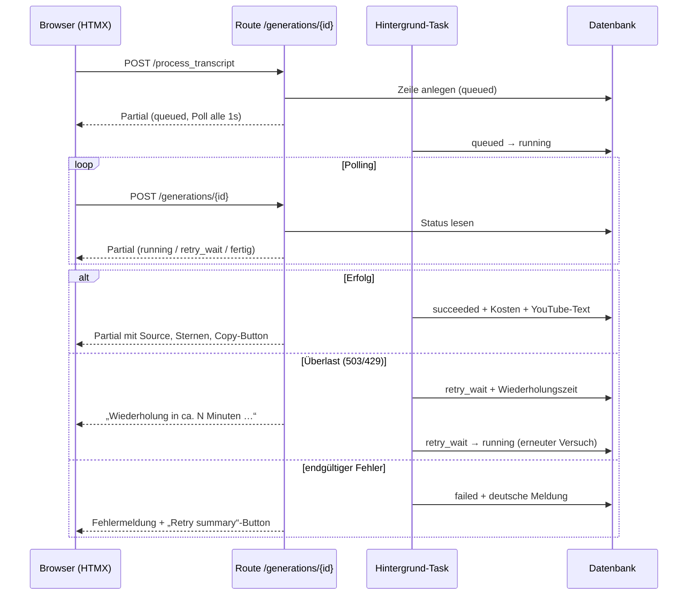
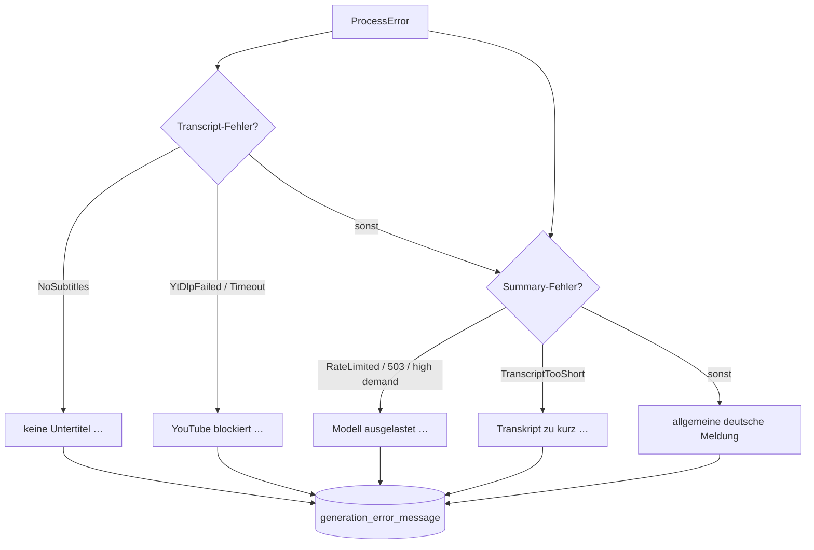

# Walkthrough: UI-Optimierungen, YouTube-Copy-Button, Timestamp-Fixes & Fehlerbehandlung

Datum: 2026-10-06 · App: `rs-summarizer` (https://rocketrecap.com) · Plan: `plan/2026-10-06-ui-and-ratings-fix/plan.md`

Dieses Dokument erklärt auf Deutsch, was geändert wurde, warum es so gebaut ist und
was als Nächstes sinnvoll wäre. Fachbegriffe werden jeweils kurz eingeordnet.

---

## 1. Was implementiert und behoben wurde

### 1.1 Keine doppelte Zusammenfassung mehr, dafür ein YouTube-Kopierbutton (`/browse`)

**Problem:** Jede Zusammenfassung erschien zweimal: einmal als formatierter Text,
einmal als zweiter Block im `<footer>` (Fußbereich des Artikels).

**Lösung:** Der Footer-Block ist ersatzlos gestrichen. Der Text wird genau einmal
gerendert, Zeitstempel darin sind direkt anklickbar (sie springen im YouTube-Video
an die Stelle). Zusätzlich gibt es den Button **„📋 Für YouTube kopieren“**:

- Ein Klick kopiert den für YouTube-Kommentare optimierten Text in die Zwischenablage
  (`*fett*` statt `**fett**`, Links mit `-dot-` statt Punkt, damit YouTubes Spamfilter
  den Kommentar nicht schluckt).
- Der Kopiertext liegt unsichtbar im Button (`data-clipboard`-Attribut — ein
  HTML-Attribut, das Daten für JavaScript bereithält, ohne etwas anzuzeigen).
  So wird nichts doppelt sichtbar übertragen.
- Nach dem Klick zeigt der Button kurz **„Kopiert! ✓“** als Bestätigung.

```html
<button type="button" class="yt-copy-btn outline"
        data-clipboard="*Intro* 1:23 ...">📋 Für YouTube kopieren</button>
```

### 1.2 Einstellige Minuten werden jetzt verlinkt

**Problem:** Zeitstempel wie `1:23` oder `9:50` wurden ignoriert, weil der reguläre
Ausdruck (Regex — eine Mustersprache zum Finden von Textstellen) zwingend zwei
Minuten-Ziffern verlangte.

**Lösung:** Der Regex in `src/utils/timestamp_linker.rs` lautet nun:

```text
\b(?:\d{1,2}:)?[0-5]?\d:[0-5]\d\b
```

`[0-5]?\d` bedeutet: Minuten von 0 bis 59, ein- oder zweistellig. Sekunden bleiben
zweistellig, sodass Verhältnisse wie `16:9` oder CSS-Werte wie `16:09px` weiterhin
nicht verlinkt werden.

### 1.3 Modell, Kosten — und sonst nichts

Auf `/browse` und in fertigen Resultaten stehen jetzt **Modellname** und **Kosten**.
Inferenz- und Bearbeitungszeiten (technische Zeitmessungen, die Nutzer nicht
brauchen) werden nicht angezeigt. Die Preisformatierung (`src/utils/cost_format.rs`):

| Kosten | Anzeige |
|---|---|
| ab 1 Cent (z. B. `0.0387975`) | 2 Stellen: `$0.04` |
| unter 1 Cent (z. B. `0.005578`) | 3 Stellen: `$0.006` |
| 0 oder negativ (Gratis-Modelle, alte Datenfehler) | keine Kostenanzeige |

### 1.4 Startseite zeigt dasselbe wie `/browse`

Nach der Generierung (per HTMX — einer Technik, bei der der Browser HTML-Schnipsel
nachlädt, ohne die Seite neu zu laden) enthält das Ergebnis jetzt ebenfalls:
Source-Link, Bewertungs-Sterne, Modell, Kosten und Kopierbutton. Die Bewertungen
erkennen dabei den eigenen Nutzer (per Client-IP, wie auf `/browse`). Die
Reihenfolge bei Mehrfach-Eingaben ist unverändert.

### 1.5 Verständliche Fehlermeldungen auf Deutsch

Statt `Summary generation failed unexpectedly` gibt es jetzt handlungsorientierte
Meldungen (`user_facing_error_message` in `src/tasks.rs`):

| Situation | Meldung |
|---|---|
| Keine Untertitel | „Für dieses Video sind keine Untertitel verfügbar. Du kannst das Transkript unter ‚Erweiterte Optionen‘ manuell einfügen.“ |
| YouTube blockiert den Abruf | „YouTube blockiert derzeit den automatischen Untertitel-Abruf. Bitte füge das Transkript unter ‚Erweiterte Optionen‘ manuell ein oder versuche es später noch einmal.“ |
| Modell überlastet (503, 429, Quota) | „Das ausgewählte KI-Modell ist momentan ausgelastet. Ein automatischer Neuversuch läuft, oder du kannst ein anderes Modell auswählen.“ |
| Transkript zu kurz | „Das Transkript ist zu kurz für eine Zusammenfassung (mindestens 30 Wörter erforderlich).“ |

Unbekannte Fehler erhalten eine allgemeine deutsche Meldung. Wichtiges Detail:
Technische Interna (z. B. die komplette `yt-dlp`-Befehlszeile aus Fehlermeldungen)
gelangen dadurch nicht mehr in die Datenbank und werden Nutzer nie angezeigt.

### 1.6 Lesbare Retry-Anzeige

Statt `Retry scheduled 2026-10-06T05:15:30Z` steht jetzt z. B.:

> **Wiederholung in ca. 1 Minute (geplant um 05:15 Uhr)**

Die Uhrzeit ist UTC (Containerzeit). Der Roh-Zeitstempel wird nie mehr angezeigt.

### 1.7 Bonus-Fix: alte Datenbankzeilen lesbar gemacht

Die Produktivdatenbank (19.601 Zeilen) enthält NULL-Werte (leere Felder) in Spalten
wie `summary`, `cost` oder `timestamps_done` — insgesamt über 3.500 betroffene
Zeilen. Bisher ließ **eine** solche Zeile die **gesamte** Browse-Seite fehlschlagen.
Die Lesezugriffe nutzen nun `COALESCE` (eine SQL-Funktion, die NULL durch einen
Ersatzwert wie `''` oder `0` ersetzt). Verifiziert gegen die echte Datenbankkopie:
Seite 1 rendert 20 Artikel trotz enthaltener NULL-Zeilen.

### Ablaufdiagramm: Generierung, Fehler und Retry-Polling





### Testlage

- **Unit:** Preisformat, Timestamp-Regex (ein-/zweistellig, Gegenbeispiele),
  Fehlermeldungen (alle 4 Fälle + Fallback ohne Interna-Leak), Retry-Anzeige.
- **Integration (`tests/integration_ui.rs`):** `/browse` ohne Footer-Duplikat mit
  Button; Partial im Status `succeeded` mit Source/Rating/Button; `retry_wait` mit
  freundlicher Zeit ohne ISO-Rohwert; `failed` mit deutscher Meldung.
- **Regression:** synthetische Legacy-DB mit NULLs sowie die echte 2,1-GB-Kopie
  (read-only) rendern fehlerfrei; zusätzlich End-to-End-Lauf des Servers gegen eine
  60-Zeilen-Prod-Kopie (`/browse`: 20 Artikel, 17 Copy-Buttons, 64 Timestamp-Links).
- `cargo fmt` sauber; `cargo clippy --all-targets --all-features` ohne Warnungen im
  eigenen Code (7 Warnungen nur im unveränderten `third_party/fast-umap`).

---

## 2. Architektur- und Designentscheidungen

1. **Ein Rendering, ein Link-Lauf:** `replace_timestamps_in_html` läuft jetzt über
   `summary_html` statt über den gestrichenen Footer — auf `/browse` und im Partial
   identisch. Eine Funktion, zwei Aufrufstellen, kein Spezialfall mehr.
2. **Versteckte Nutzdaten statt zweitem HTML:** Der YouTube-Text liegt als
   `data-clipboard`-Attribut vor (von Askama automatisch HTML-escapet, d. h.
   Sonderzeichen wie `"` werden sicher kodiert). Kein zweiter sichtbarer Block,
   keine zweite Abfrage.
3. **Delegiertes Klick-Handling:** Ein einziger `document`-Listener (in `index.html`
   und `browse.html`) fängt alle Copy-Klicks ab — auch für Partials, die HTMX erst
   später einsetzt. Kein Skript pro Artikel nötig. Clipboard-API mit
   `textarea`/`execCommand`-Fallback für ältere Browser.
4. **Fehlercode und Meldung getrennt:** `mark_error` bestimmt den internen
   `PublicErrorCode` weiter aus dem Rohfehler (Verhalten unverändert), speichert
   aber die deutsche Nutzermeldung. Codes bleiben für Auswertung stabil.
5. **NULL-Robustheit statt Migration:** Kein Schema-Umbau, nur `COALESCE` in den
   zwei `Summary`-Lesepfaden (`fetch_summary`, `fetch_browse_page`) via
   `QueryBuilder` (von `sqlx` erzwungen, da dynamische SQL-Strings abgelehnt
   werden). Unbenutzter `MetadataCache` und der Export-CLI-Pfad wurden bewusst
   nicht angerührt (minimaler Eingriff).
6. **Geteiltes Rating-CSS:** Das Stern-Styling lag inline nur in `browse.html` und
   liegt nun in `static/ratings.css`, eingebunden von beiden Seiten — sonst wären
   die Sterne im Partial ungestylt gewesen.

**Abweichungen vom Plan (`plan.md`):**

- Die Retry-Uhrzeit wird in **UTC** statt Europe/Berlin gezeigt (Beispiel im
  Prompt: 05:15Z → „07:15 Uhr“). Ein Zeitzonen-Crate (`chrono-tz`) wäre eine neue
  Abhängigkeit für eine rein kosmetische Angabe gewesen; die relative Zeitspanne
  („in ca. N Minuten“) als Kern der Anforderung ist zeitzonenfrei korrekt.
- Zusätzlich zum Plan: generische deutsche Fallback-Meldung für nicht
  spezifizierte Fehler (statt englischer Rohtexte) sowie der NULL-Fix in `db.rs`
  — beides aus der Prod-DB-Analyse begründet und rückwärtskompatibel.

---

## 3. Learnings und Vorschläge für zukünftige Erweiterungen

**Learnings:**

- Die Prod-DB-Kopie war der wertvollste Testfall: NULL-Zeilen und negative Kosten
  fielen erst durch systematisches Zählen aller Spalten auf — Annahmen über
  „NOT NULL“ aus den Migrationen galten nicht für Alt-Daten.
- Der `sqlx`-Schutz vor dynamischen SQL-Strings (`SqlSafeStr`) erzwang den
  saubereren `QueryBuilder`-Weg; String-`format!` für SQL kompiliert nicht mehr.
- Überraschend: `int::div_ceil` meldete diese Toolchain als instabil — einfache
  Arithmetik `(s + 59) / 60` war der pragmatische Ersatz.

**Vorschläge:**

- Retry-Uhrzeit optional in Europe/Berlin zeigen (nur mit `chrono-tz`, wenn das
  gewünscht wird) oder ganz auf die relative Angabe reduzieren.
- Alte englische Fehlermeldungen in der DB per Migration auf die neuen deutschen
  Texte mappen (nur Anzeige-Kosmetik für Archivseiten).
- Negative Kosten per Einmal-Skript auf `0.0` korrigieren (Datenhygiene).
- Copy-Button-Skript in eine Datei `static/copy.js` auslagern (derzeit dupliziert
  in zwei Templates).
- Browser-Test für den Copy-Button (Clipboard-Permission im WebDriver setzen).

---

## 4. Neu benötigte Programme/Pakete für das Dockerfile

**Keine.** Es wurden keine Crates, Pakete oder CLI-Tools hinzugefügt. Genutzt wurden
ausschließlich vorhandene Mittel: Rust/Cargo, `sqlx`/`SQLite`, Askama, `chrono`,
`regex` sowie Python 3 nur lokal zur DB-Inspektion (kein Laufzeitbedarf).
