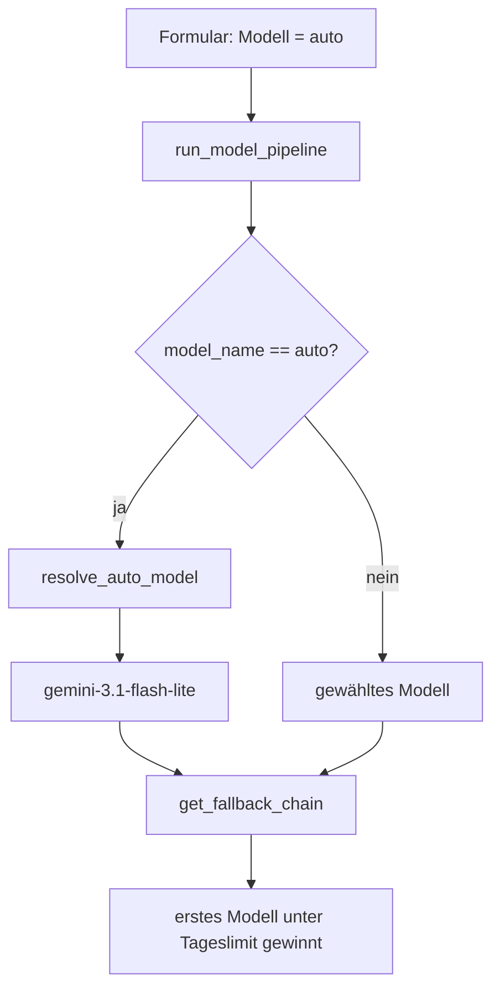
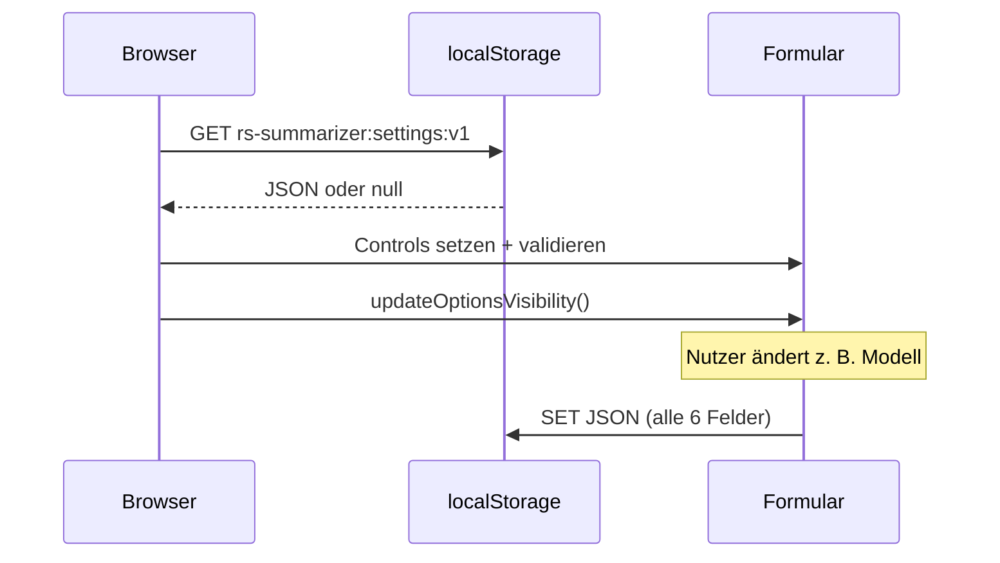

# Walkthrough: auto → gemini-3.1-flash-lite + Einstellungen im localStorage

Datum: 2026-10-08 · Ordner: `plan/20261008_01_local_storage/` · Release: v1.8.5

Dieses Dokument fasst zusammen, was wirklich umgesetzt wurde, wo die
Tests den Plan verändert haben und was man daraus lernen kann. Es ist
absichtlich so geschrieben, dass auch Leser ohne Tiefenwissen über das
Repo folgen können — Fachbegriffe werden kurz erklärt.

## 1. Was exakt implementiert wurde

### 1.1 `auto` wählt immer `gemini-3.1-flash-lite`

**Ausgangslage:** Im Formular gibt es die Modelloption `auto`. Dahinter
stand eine **Heuristik** (eine Faustregel, kein gelerntes Modell): Bei
Hacker-News-Texten wurde nach Wortzahl entschieden, bei YouTube nach der
Transkriptdauer — kurze Inhalte bekamen `gemini-3.5-flash-lite`, lange
`gemini-3.6-flash`.

**Neues Verhalten:** `auto` löst immer zu `gemini-3.1-flash-lite` auf.
Keine Verzweigung mehr, keine Längenmessung. Die normale
**Fallback-Kette** (Ersatzmodelle, falls das Wunschmodell sein
Tageslimit erreicht hat) gilt unverändert weiter.

**Geänderte Stellen (Rust):**

- `src/tasks.rs`
  - Neu: `pub const AUTO_MODEL: &str = "gemini-3.1-flash-lite"` plus
    `pub fn resolve_auto_model() -> &'static str` als einzige
    Auflösungsstelle.
  - `run_model_pipeline`: Der `if model_name == "auto"`-Block schrumpft
    auf eine Zeile:
    ```rust
    let mut model_name = initial_model_name.to_string();
    if model_name == "auto" {
        model_name = resolve_auto_model().to_string();
    }
    ```
  - Der Parameter `is_hn` (war Hacker News? Ja/Nein) wurde aus
    `run_model_pipeline` **entfernt**, weil nur die alte Heuristik ihn
    brauchte. Alle drei Aufrufer in `process_summary_inner` wurden
    angepasst.
  - Gelöscht: `get_transcript_duration_secs` (Dauer aus
    Zeitstempel-Zeilen schätzen) samt seiner drei Tests — nach dem
    Entfernen der Heuristik ohne jede Verwendung.
- `src/templates.rs` / `src/routes/mod.rs`: `IndexTemplate` bekommt das
  Feld `auto_model` (Wert: `crate::tasks::AUTO_MODEL`), damit das
  HTML-Label aus derselben Quelle kommt wie die Logik (**Single Source
  of Truth**: ein Wert steht nur an einer Stelle im Code).
- `templates/index.html`: Das Dropdown zeigt jetzt
  `Auto (gemini-3.1-flash-lite)` statt `Auto (Heuristik)`.



### 1.2 Formulareinstellungen werden im Browser gespeichert

**Ausgangslage:** Modell, Thinking-Effort, Ausgabesprache, Glossar- und
Suchoptionen mussten bei jedem Besuch neu gewählt werden. Eine
Nutzerverwaltung (Konten, Login, Datenbank) sollte ausdrücklich
**nicht** eingeführt werden.

**Lösung:** Der Browser speichert die Auswahl in seinem
**`localStorage`** — einem kleinen Schlüssel-Wert-Speicher pro Domain,
der im Browser bleibt und nie an den Server geschickt wird. Dadurch ist
auch kein Cookie-Hinweis nötig.

**Geänderte Stellen (Template-JS in `templates/index.html`):**

- Ein Schlüssel, ein JSON-Objekt: `rs-summarizer:settings:v1` mit den
  Feldern `model`, `thinking_level`, `output_language`,
  `include_glossary`, `google_search_grounding`, `url_context`.
- **Speichern** bei jedem `change`-Event dieser Controls (Funktion
  `saveSettings`). URL- und Transkript-Eingaben werden bewusst
  **nicht** gespeichert (kein Nutzerinhalt, keine großen Texte).
- **Laden** beim Seitenstart (Funktion `loadSettings`): Werte werden
  gegen die vorhandenen `<option>`-Einträge validiert — ein veralteter
  Modellname aus einer alten Speicherung wird still ignoriert, statt
  das Formular zu beschädigen. Danach läuft die bestehende
  `updateOptionsVisibility()`, damit Thinking-Level und
  Grounding-Sichtbarkeit zum (ggf. wiederhergestellten) Modell passen.
- Alle `localStorage`-Zugriffe sind in `try/catch` gekapselt: Im
  Privatmodus mancher Browser wirft der Zugriff eine Ausnahme, die
  Seite muss trotzdem funktionieren.
- Hinweistext unter dem Absende-Button: „Deine Auswahl (…) wird
  automatisch lokal in deinem Browser gespeichert."



### 1.3 Tests

| Test | Art | Prüft |
|---|---|---|
| `tasks::tests::auto_model_always_resolves_to_flash_lite` | Unit | `resolve_auto_model()` liefert `gemini-3.1-flash-lite`, das Modell ist registriert und hat eine Fallback-Kette. |
| `index_persists_settings_in_local_storage` | Integration (`tests/integration_ui.rs`) | `GET /` liefert 200 und enthält Settings-Key, `localStorage`-Zugriffe, alle Feld-IDs, Hinweistext und das neue Auto-Label; kein `Heuristik` mehr. |
| Bestehende Suite | Regression | `cargo test`: 164 Unit + 4 Ratings + 7 UI grün; Prod-DB-Test lief gegen vorhandene `summaries.db`. |

Gates: `cargo test`, `cargo clippy --all-targets -- -D warnings` und
`cargo fmt --check` sind alle grün.

## 2. Was aufgrund der Tests anders gemacht wurde als geplant

1. **Heuristik-Tests ersetzt statt umgebaut (Plan Schritt 1).** Der
   Plan sah vor, die beiden Schwellwert-Tests auf die neue Funktion
   umzustellen. Bei der Umsetzung zeigte sich: Die alten Tests prüften
   gar nicht den echten Code, sondern duplizierten die Heuristik
   (`if words < 15000 …`) im Test selbst. Solche Tests werden nie rot,
   wenn die Implementierung falsch ist. Sie wurden daher **gelöscht**
   und durch einen Test ersetzt, der die echte Funktion aufruft und
   zusätzlich die Registrierung des Modells prüft.
2. **`is_hn`-Parameter entfernt statt behalten.** Nach dem Streichen
   der Heuristik meldete Clippy (`-D warnings`) den nun ungenutzten
   Parameter. Statt ihn mit Unterstrich (`_is_hn`) zu betäuben, wurde
   die Signatur ehrlich bereinigt und die drei Aufrufer angepasst.
3. **`get_transcript_duration_secs` gelöscht.** Die Hilfsfunktion wäre
   nur noch von ihren eigenen Tests verwendet worden
   (`dead_code`-Warnung im normalen Build). Da `auto` per Aufgabe
   dauerhaft keine Längenheuristik mehr nutzt, wurde sie samt Tests
   entfernt (der Code bleibt über die Git-Historie wiederherstellbar).
4. **Auto-Label an die Logik gekoppelt.** Geplant war nur, `auto`
   umzustellen. Der Text `Auto (Heuristik)` im Dropdown wäre dadurch
   falsch geworden. Statt den Modellnamen im Template fest zu
   verdrahten, bekommt `IndexTemplate` jetzt `auto_model` aus
   `tasks::AUTO_MODEL` injiziert — Label und Logik können nicht mehr
   auseinanderlaufen.

## 3. Learnings und mögliche Erweiterungen

**Learnings:**

- Tests, die die Implementierung nachbauen statt sie aufzurufen, sind
  Scheinsicherheit. Die Faustregel: Ein guter Regressionstest muss rot
  werden, wenn man die Implementierung kaputtmacht.
- `cargo clippy --all-targets -- -D warnings` ist ein hervorragender
  „Totholz-Detektor": Ungenutzte Parameter und Funktionen fallen sofort
  auf und zwingen zu sauberen Schnitten statt Provisorien.
- Die Browser-Extension (`extension/popup.js`) persistiert
  Einstellungen bereits via `chrome.storage.local` — das Muster
  (ein Objekt, speichern bei Änderung, laden beim Start) ließ sich
  fast 1:1 auf `localStorage` übertragen.

**Mögliche Erweiterungen:**

- **Versionsfeld im Settings-JSON:** Der Key trägt bereits ein `v1`.
  Bei künftigen Feldänderungen kann `loadSettings` alte Versionen
  migrieren oder verwerfen.
- **„Zurücksetzen"-Button:** Ein kleiner Link, der den Key löscht und
  die Defaults wiederherstellt.
- **`auto` in der Extension anbieten:** Das Extension-Dropdown kennt
  derzeit kein `auto`; es könnte denselben Server-Mechanismus nutzen.
- **Thinking-Default pro Modell:** Aktuell ist `high` vorausgewählt,
  was nur Gemini-3-Modelle verstehen. Man könnte den Default aus dem
  gewählten Modell ableiten.

## 4. Neue Programme für den Docker-Container

**Keine.** Die Änderung besteht aus Rust-Code (kompiliert in das
bestehende Binary), Template-JS (wird vom Server ausgeliefert, läuft im
Browser des Nutzers) und Tests. Es werden keine neuen Systempakete,
Binaries oder Dienste benötigt. Auch `Dockerfile`-Änderungen sind
nicht erforderlich.
